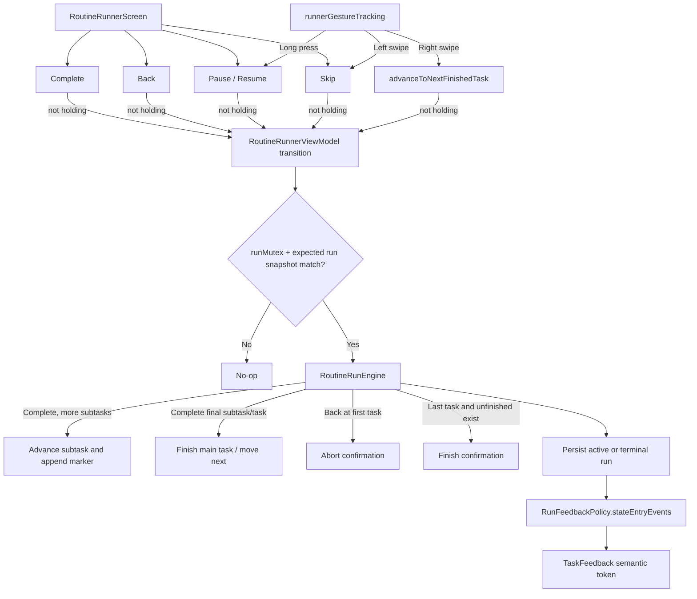
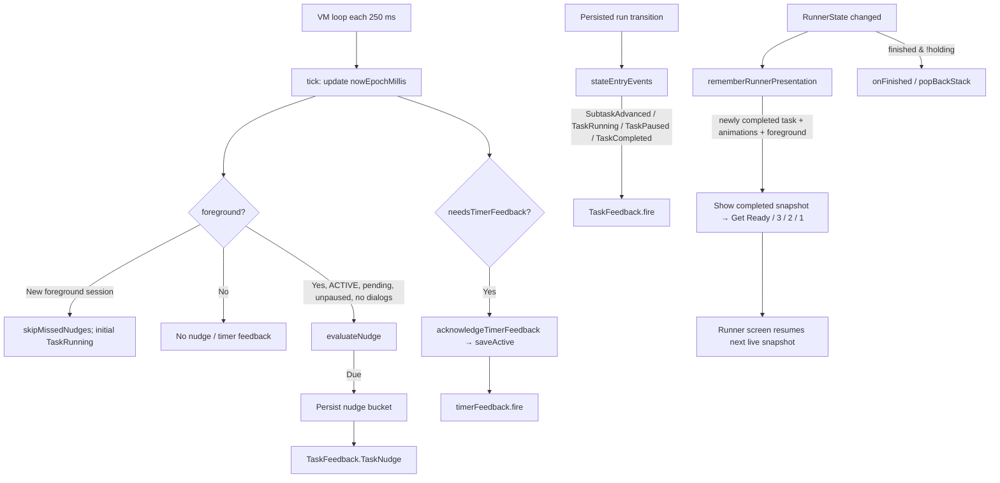
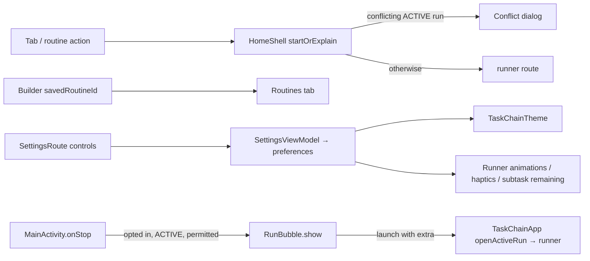

# TaskChain UI Action / Hook Trigger Diagrams — `origin/refactor-feature-integration`

**Agent-use contract:** This document answers **“Which UI component invokes which function, and under what condition?”** Match an event ID (e.g. `RUN-003`) to source anchors, then follow the `call_chain`. Its companion JSONL is intentionally machine-parseable and keyed by stable IDs. All references are to [`9ac12352b6dd20faffd8e2851b48c54d28d9024e`](https://github.com/matthewdmanning/TaskChain/tree/9ac12352b6dd20faffd8e2851b48c54d28d9024e) on the remote branch `refactor-feature-integration`, **not** stale `feature/substeps`.

**Static-analysis caveat:** Every documented behavior is derived from code, not from an instrumented Android run. `->` denotes a call or handoff, not necessarily synchronous execution; ViewModels frequently dispatch coroutines and state flows. A `render` entry records a conditional composable invocation, **not** a user event. This is an app-owned UI call index, not a complete inventory of external Material/cyberpunkAndroid internals.

## 1. User action → component → handler: builder

```mermaid
flowchart TD
  USER[User edits routine] --> FORM[RoutineBuilderRoute form]
  FORM -->|title / description / switches| MUT[BuilderViewModel.set* → mutateDraft]
  USER -->|expand task| ACC[CyberAccordion changeExpansion]
  ACC -->|old pending timer valid| EDIT[editTask(index)]
  EDIT --> EXP[Show expanded task]
  EXP --> PICK[Main duration NumberPicker]
  PICK -->|OK; task still current| DUR[setPendingTimerSeconds]
  EXP --> SUB[BuilderSubtaskEditor]
  SUB -->|Add| ADD[addSubtask(taskId)]
  SUB -->|Title or raw seconds| SET[setSubtaskTitle / setSubtaskDuration]
  SUB -->|Remove / drag / a11y| REORDER[removeSubtask / moveSubtask]
  USER -->|Save| SAVE[save]
  SAVE --> CHECK{validateBuilderState valid?}
  CHECK -->|No| ERR[failedSaveCount increment]
  ERR --> FOCUS[LaunchedEffect: expand failing task + scroll]
  CHECK -->|Yes| PERSIST[RoutineRepository.save → reminder scheduler]
  PERSIST --> NAV[savedRoutineId → LaunchedEffect onSaved]
```

### Guards that commonly explain missing builder actions

- `editTask` or `addTask` **returns without change** when the previously edited main task has nonblank invalid `pendingTimerSeconds`; see `FeatureViewModels.kt:512–545`.
- Parent duration selection is **disabled** if `task.subtasks` is nonempty. A positive picker result is accepted only if the corresponding task ID can still be resolved and selected; see `TaskChainApp.kt:952–1001`.
- First `addSubtask` moves the parent timer into the new subtask and clears the parent timer; subsequent subtasks get a default duration; see `FeatureViewModels.kt:340–359`.
- Subtask duration `CyberTextField` never opens the native duration picker. Raw invalid text is retained for validation while `RoutineSubtask.durationSeconds` stays at its prior valid value; see `FeatureViewModels.kt:376–395`.
- Save validates synchronously and may reject before starting the async repository write. The `failedSaveCount` effect expands/scrolls to a failing field; see `TaskChainApp.kt:704–725` and `FeatureViewModels.kt:620–635`.

## 2. User action → domain transition: runner



### Critical runner behaviors

- **Complete is subtask-aware**: one press per subtask until its final subtask; main timer remains continuous; the last completed subtask can also finish the main task.
- **Right swipe only advances to the next *finished* main task**, if there is one. It does not blindly select the next pending task.
- **Left swipe skips the current main task**. A long press toggles Pause/Resume. Pointer recognition checks dominant horizontal travel and cancellation for vertical movement; accessibility actions provide equivalents.
- **Completion animations are a two-sided gate**: ViewModel may call `prepareNextTask` to shift the next timer start, and presenter holds the previously completed run snapshot. While holding, interactive controls are suppressed; navigation waits for `holdingCompletion = false`.

## 3. Periodic and state-driven calls (not click callbacks)



The zero timer hook `timerFeedback.fire(...)` and semantic token hooks `TaskFeedback.fire(...)` are **different**, with different gating. Acknowledged zero feedback does not itself complete a task or advance a subtask. UI buttons have an independent `pressAction` vibration wrapper. Review `FB-*` records before debugging sound or haptics.

## 4. Navigation, settings, and bubble hooks



## 5. Complete action index (ID → condition → call chain → outcome → source)

The trigger and guard columns are deliberately separate. For a reported failure, search first by **UI label** or `debug_tags` in the JSONL, then check **guard**, **call chain**, and **source** in that order. Render/state-driven entries are indexed alongside direct user actions so agents do not assume every hook originates in an `onClick`.

### Navigation and Home (11 events)

| ID | Component | Trigger | Guard | Call chain | Outcome | Source |
|---|---|---|---|---|---|---|
| `NAV-001` | MainActivity | Android onCreate | Activity created or recreated | `AppContainer.migrateLegacyData → recoverTerminalRun → setContent(TaskChainApp)` | Migrate and recover before composing UI | [MainActivity.kt:23–33](https://github.com/matthewdmanning/TaskChain/blob/9ac12352b6dd20faffd8e2851b48c54d28d9024e/app/src/main/java/com/taskchain/MainActivity.kt#L23-L33) |
| `NAV-002` | TaskChainApp | openActiveRun flag becomes true | An ACTIVE saved run exists | `LaunchedEffect(openActiveRun) → activeRun.observeActive.first → navController.navigate(runnerRoute)` | Open saved active run, including bubble launch | [ui/TaskChainApp.kt:181–194](https://github.com/matthewdmanning/TaskChain/blob/9ac12352b6dd20faffd8e2851b48c54d28d9024e/app/src/main/java/com/taskchain/ui/TaskChainApp.kt#L181-L194) |
| `NAV-003` | HomeShell | Bottom navigation item | Any tab selected | `onSelectedTabChange → selectedTab assignment` | Switches displayed tab in HomeShell; saved across recomposition | [ui/TaskChainApp.kt:273–305](https://github.com/matthewdmanning/TaskChain/blob/9ac12352b6dd20faffd8e2851b48c54d28d9024e/app/src/main/java/com/taskchain/ui/TaskChainApp.kt#L273-L305) |
| `NAV-004` | TodayRoute | Empty-state New Routine | All three Today routine sections empty | `onCreate → navController.navigate(builderRoute(null))` | Opens new routine builder | [ui/TaskChainApp.kt:387–395](https://github.com/matthewdmanning/TaskChain/blob/9ac12352b6dd20faffd8e2851b48c54d28d9024e/app/src/main/java/com/taskchain/ui/TaskChainApp.kt#L387-L395), [ui/TaskChainApp.kt:197–205](https://github.com/matthewdmanning/TaskChain/blob/9ac12352b6dd20faffd8e2851b48c54d28d9024e/app/src/main/java/com/taskchain/ui/TaskChainApp.kt#L197-L205) |
| `NAV-005` | RoutinesRoute | New Routine | Routines screen visible | `onCreate → navController.navigate(builderRoute(null))` | Opens new routine builder | [ui/TaskChainApp.kt:524–537](https://github.com/matthewdmanning/TaskChain/blob/9ac12352b6dd20faffd8e2851b48c54d28d9024e/app/src/main/java/com/taskchain/ui/TaskChainApp.kt#L524-L537), [ui/TaskChainApp.kt:197–205](https://github.com/matthewdmanning/TaskChain/blob/9ac12352b6dd20faffd8e2851b48c54d28d9024e/app/src/main/java/com/taskchain/ui/TaskChainApp.kt#L197-L205) |
| `NAV-006` | RoutineCard | Edit routine | Edit callback passed by RoutinesRoute | `onEdit(routine) → navigate(builderRoute(routine.id))` | Loads routine builder for selected routine | [ui/TaskChainApp.kt:508–522](https://github.com/matthewdmanning/TaskChain/blob/9ac12352b6dd20faffd8e2851b48c54d28d9024e/app/src/main/java/com/taskchain/ui/TaskChainApp.kt#L508-L522), [ui/TaskChainApp.kt:589–603](https://github.com/matthewdmanning/TaskChain/blob/9ac12352b6dd20faffd8e2851b48c54d28d9024e/app/src/main/java/com/taskchain/ui/TaskChainApp.kt#L589-L603) |
| `NAV-007` | CompactRoutineRow / RoutineCard | Start routine | No other ACTIVE run with different routine ID | `onStart(routine) → HomeShell.startOrExplain → navigate(runnerRoute(routine.id))` | Opens runner route | [ui/TaskChainApp.kt:265–272](https://github.com/matthewdmanning/TaskChain/blob/9ac12352b6dd20faffd8e2851b48c54d28d9024e/app/src/main/java/com/taskchain/ui/TaskChainApp.kt#L265-L272), [ui/TaskChainApp.kt:417–419](https://github.com/matthewdmanning/TaskChain/blob/9ac12352b6dd20faffd8e2851b48c54d28d9024e/app/src/main/java/com/taskchain/ui/TaskChainApp.kt#L417-L419), [ui/TaskChainApp.kt:605–617](https://github.com/matthewdmanning/TaskChain/blob/9ac12352b6dd20faffd8e2851b48c54d28d9024e/app/src/main/java/com/taskchain/ui/TaskChainApp.kt#L605-L617) |
| `NAV-008` | HomeShell | Start routine while another ACTIVE run differs | activeRun.status ACTIVE and routine IDs differ | `startOrExplain → blockedRoutine = routine` | Displays active-run conflict dialog; no new run navigation | [ui/TaskChainApp.kt:263–272](https://github.com/matthewdmanning/TaskChain/blob/9ac12352b6dd20faffd8e2851b48c54d28d9024e/app/src/main/java/com/taskchain/ui/TaskChainApp.kt#L263-L272), [ui/TaskChainApp.kt:306–327](https://github.com/matthewdmanning/TaskChain/blob/9ac12352b6dd20faffd8e2851b48c54d28d9024e/app/src/main/java/com/taskchain/ui/TaskChainApp.kt#L306-L327) |
| `NAV-009` | HomeShell conflict dialog | Resume existing run | Dialog visible and existing ACTIVE run | `onResume(run.routineId) → navigate(runnerRoute)` | Opens already active run | [ui/TaskChainApp.kt:306–324](https://github.com/matthewdmanning/TaskChain/blob/9ac12352b6dd20faffd8e2851b48c54d28d9024e/app/src/main/java/com/taskchain/ui/TaskChainApp.kt#L306-L324), [ui/TaskChainApp.kt:197–205](https://github.com/matthewdmanning/TaskChain/blob/9ac12352b6dd20faffd8e2851b48c54d28d9024e/app/src/main/java/com/taskchain/ui/TaskChainApp.kt#L197-L205) |
| `NAV-010` | HomeShell conflict dialog | Keep browsing / dismiss | blockedRoutine is not null | `blockedRoutine = null` | Closes conflict dialog | [ui/TaskChainApp.kt:306–326](https://github.com/matthewdmanning/TaskChain/blob/9ac12352b6dd20faffd8e2851b48c54d28d9024e/app/src/main/java/com/taskchain/ui/TaskChainApp.kt#L306-L326) |
| `NAV-011` | TodayRoute active-run card | Resume current run | An ACTIVE run exists | `onResume(run) → navigate(runnerRoute)` | Opens current runner | [ui/TaskChainApp.kt:357–385](https://github.com/matthewdmanning/TaskChain/blob/9ac12352b6dd20faffd8e2851b48c54d28d9024e/app/src/main/java/com/taskchain/ui/TaskChainApp.kt#L357-L385), [ui/TaskChainApp.kt:292–300](https://github.com/matthewdmanning/TaskChain/blob/9ac12352b6dd20faffd8e2851b48c54d28d9024e/app/src/main/java/com/taskchain/ui/TaskChainApp.kt#L292-L300) |

### Builder and subtask editor (28 events)

| ID | Component | Trigger | Guard | Call chain | Outcome | Source |
|---|---|---|---|---|---|---|
| `BLD-001` | RoutineBuilderRoute | Routine name CyberTextField | Any edited string | `viewModel.setTitle → mutateDraft` | Sets BuilderState.title, revalidates retained errors, marks unsaved | [ui/TaskChainApp.kt:755–772](https://github.com/matthewdmanning/TaskChain/blob/9ac12352b6dd20faffd8e2851b48c54d28d9024e/app/src/main/java/com/taskchain/ui/TaskChainApp.kt#L755-L772), [ui/FeatureViewModels.kt:318–326](https://github.com/matthewdmanning/TaskChain/blob/9ac12352b6dd20faffd8e2851b48c54d28d9024e/app/src/main/java/com/taskchain/ui/FeatureViewModels.kt#L318-L326), [ui/FeatureViewModels.kt:443–446](https://github.com/matthewdmanning/TaskChain/blob/9ac12352b6dd20faffd8e2851b48c54d28d9024e/app/src/main/java/com/taskchain/ui/FeatureViewModels.kt#L443-L446) |
| `BLD-002` | RoutineBuilderRoute | Routine description CyberTextArea | Any edited string | `viewModel.setDescription → mutateDraft` | Sets description | [ui/TaskChainApp.kt:773–780](https://github.com/matthewdmanning/TaskChain/blob/9ac12352b6dd20faffd8e2851b48c54d28d9024e/app/src/main/java/com/taskchain/ui/TaskChainApp.kt#L773-L780), [ui/FeatureViewModels.kt:448–451](https://github.com/matthewdmanning/TaskChain/blob/9ac12352b6dd20faffd8e2851b48c54d28d9024e/app/src/main/java/com/taskchain/ui/FeatureViewModels.kt#L448-L451) |
| `BLD-003` | RoutineBuilderRoute | Sound Enabled row | Boolean toggled | `LabeledSwitchRow → viewModel.setSoundEnabled → mutateDraft` | Updates draft routine sound enabled | [ui/TaskChainApp.kt:793–796](https://github.com/matthewdmanning/TaskChain/blob/9ac12352b6dd20faffd8e2851b48c54d28d9024e/app/src/main/java/com/taskchain/ui/TaskChainApp.kt#L793-L796), [ui/FeatureViewModels.kt:505–509](https://github.com/matthewdmanning/TaskChain/blob/9ac12352b6dd20faffd8e2851b48c54d28d9024e/app/src/main/java/com/taskchain/ui/FeatureViewModels.kt#L505-L509) |
| `BLD-004` | RoutineBuilderRoute | Vibrate Enabled row | Boolean toggled | `LabeledSwitchRow → viewModel.setVibrateEnabled → mutateDraft` | Updates draft routine vibration enabled | [ui/TaskChainApp.kt:793–796](https://github.com/matthewdmanning/TaskChain/blob/9ac12352b6dd20faffd8e2851b48c54d28d9024e/app/src/main/java/com/taskchain/ui/TaskChainApp.kt#L793-L796), [ui/FeatureViewModels.kt:505–509](https://github.com/matthewdmanning/TaskChain/blob/9ac12352b6dd20faffd8e2851b48c54d28d9024e/app/src/main/java/com/taskchain/ui/FeatureViewModels.kt#L505-L509) |
| `BLD-005` | CyberAccordion task | Accordion header or onExpandedChange(true) | Target task found; previous pending main duration permits editTask | `changeExpansion → viewModel.editTask → expandedTaskId set` | Expands task edit panel; resets task-name editing | [ui/TaskChainApp.kt:826–840](https://github.com/matthewdmanning/TaskChain/blob/9ac12352b6dd20faffd8e2851b48c54d28d9024e/app/src/main/java/com/taskchain/ui/TaskChainApp.kt#L826-L840), [ui/FeatureViewModels.kt:512–524](https://github.com/matthewdmanning/TaskChain/blob/9ac12352b6dd20faffd8e2851b48c54d28d9024e/app/src/main/java/com/taskchain/ui/FeatureViewModels.kt#L512-L524) |
| `BLD-006` | CyberAccordion task | Accordion collapse | expandedTaskId equals clicked task ID | `changeExpansion(false) → expandedTaskId = null → editingNameTaskId = null` | Collapses current panel | [ui/TaskChainApp.kt:826–840](https://github.com/matthewdmanning/TaskChain/blob/9ac12352b6dd20faffd8e2851b48c54d28d9024e/app/src/main/java/com/taskchain/ui/TaskChainApp.kt#L826-L840) |
| `BLD-007` | CyberAccordion task | Task title when expanded | isExpanded true | `editingNameTaskId = task.id.value` | Switches title text to inline CyberTextField | [ui/TaskChainApp.kt:899–921](https://github.com/matthewdmanning/TaskChain/blob/9ac12352b6dd20faffd8e2851b48c54d28d9024e/app/src/main/java/com/taskchain/ui/TaskChainApp.kt#L899-L921) |
| `BLD-008` | CyberAccordion inline title field | Task title changes | Active task open and editable | `viewModel.setPendingTaskTitle → mutateDraft` | Updates task title and pending title | [ui/TaskChainApp.kt:900–909](https://github.com/matthewdmanning/TaskChain/blob/9ac12352b6dd20faffd8e2851b48c54d28d9024e/app/src/main/java/com/taskchain/ui/TaskChainApp.kt#L900-L909), [ui/FeatureViewModels.kt:453–460](https://github.com/matthewdmanning/TaskChain/blob/9ac12352b6dd20faffd8e2851b48c54d28d9024e/app/src/main/java/com/taskchain/ui/FeatureViewModels.kt#L453-L460) |
| `BLD-009` | CyberAccordion duration | Main task duration picker | task.subtasks.isEmpty; button enabled | `Native NumberPicker dialog → positive button → editTask → setPendingTimerSeconds` | Commits duration seconds or empty for zero; Cancel does not write | [ui/TaskChainApp.kt:952–1001](https://github.com/matthewdmanning/TaskChain/blob/9ac12352b6dd20faffd8e2851b48c54d28d9024e/app/src/main/java/com/taskchain/ui/TaskChainApp.kt#L952-L1001), [ui/FeatureViewModels.kt:463–470](https://github.com/matthewdmanning/TaskChain/blob/9ac12352b6dd20faffd8e2851b48c54d28d9024e/app/src/main/java/com/taskchain/ui/FeatureViewModels.kt#L463-L470) |
| `BLD-010` | CyberAccordion task drag handle | Long-press and vertical drag | absolute dragOffset >= DRAG_REORDER_THRESHOLD_PX; current task ID found | `detectDragGesturesAfterLongPress → viewModel.moveTask` | Reorders task and retains edit target by ID | [ui/TaskChainApp.kt:865–897](https://github.com/matthewdmanning/TaskChain/blob/9ac12352b6dd20faffd8e2851b48c54d28d9024e/app/src/main/java/com/taskchain/ui/TaskChainApp.kt#L865-L897), [ui/FeatureViewModels.kt:548–563](https://github.com/matthewdmanning/TaskChain/blob/9ac12352b6dd20faffd8e2851b48c54d28d9024e/app/src/main/java/com/taskchain/ui/FeatureViewModels.kt#L548-L563) |
| `BLD-011` | CyberAccordion task accessibility | Move up / Move down custom action | Only if adjacent index exists | `CustomAccessibilityAction → viewModel.moveTask` | Accessible task reorder | [ui/TaskChainApp.kt:854–859](https://github.com/matthewdmanning/TaskChain/blob/9ac12352b6dd20faffd8e2851b48c54d28d9024e/app/src/main/java/com/taskchain/ui/TaskChainApp.kt#L854-L859), [ui/FeatureViewModels.kt:548–563](https://github.com/matthewdmanning/TaskChain/blob/9ac12352b6dd20faffd8e2851b48c54d28d9024e/app/src/main/java/com/taskchain/ui/FeatureViewModels.kt#L548-L563) |
| `BLD-012` | RoutineBuilderRoute | Remove task | Task index exists | `viewModel.removeTask → state edit` | Removes task with nested subtasks and pending raw strings | [ui/TaskChainApp.kt:1024–1034](https://github.com/matthewdmanning/TaskChain/blob/9ac12352b6dd20faffd8e2851b48c54d28d9024e/app/src/main/java/com/taskchain/ui/TaskChainApp.kt#L1024-L1034), [ui/FeatureViewModels.kt:595–617](https://github.com/matthewdmanning/TaskChain/blob/9ac12352b6dd20faffd8e2851b48c54d28d9024e/app/src/main/java/com/taskchain/ui/FeatureViewModels.kt#L595-L617) |
| `BLD-013` | RoutineBuilderRoute | Add Task | Current pending main duration is blank or valid; invalid nonblank value blocks addTask | `viewModel.addTask("") → expandedTaskId = tasks.last.id` | Creates blank-title task and expands latest | [ui/TaskChainApp.kt:1038–1055](https://github.com/matthewdmanning/TaskChain/blob/9ac12352b6dd20faffd8e2851b48c54d28d9024e/app/src/main/java/com/taskchain/ui/TaskChainApp.kt#L1038-L1055), [ui/FeatureViewModels.kt:526–545](https://github.com/matthewdmanning/TaskChain/blob/9ac12352b6dd20faffd8e2851b48c54d28d9024e/app/src/main/java/com/taskchain/ui/FeatureViewModels.kt#L526-L545) |
| `BLD-014` | BuilderSubtaskEditor | Add Subtask | Parent task ID present; subtask editor rendered only in expanded task | `onAddSubtask → viewModel.addSubtask → mutateDraft` | Appends blank-title subtask; first copies parent timer and clears its timerSeconds | [ui/TaskChainApp.kt:1005–1016](https://github.com/matthewdmanning/TaskChain/blob/9ac12352b6dd20faffd8e2851b48c54d28d9024e/app/src/main/java/com/taskchain/ui/TaskChainApp.kt#L1005-L1016), [ui/BuilderSubtaskEditor.kt:139–146](https://github.com/matthewdmanning/TaskChain/blob/9ac12352b6dd20faffd8e2851b48c54d28d9024e/app/src/main/java/com/taskchain/ui/BuilderSubtaskEditor.kt#L139-L146), [ui/FeatureViewModels.kt:340–359](https://github.com/matthewdmanning/TaskChain/blob/9ac12352b6dd20faffd8e2851b48c54d28d9024e/app/src/main/java/com/taskchain/ui/FeatureViewModels.kt#L340-L359) |
| `BLD-015` | BuilderSubtaskEditor | Subtask title CyberTextField | Subtask located by task ID + subtask ID | `onTitleChange → viewModel.setSubtaskTitle → mutateDraft` | Updates nested subtask title | [ui/BuilderSubtaskEditor.kt:104–114](https://github.com/matthewdmanning/TaskChain/blob/9ac12352b6dd20faffd8e2851b48c54d28d9024e/app/src/main/java/com/taskchain/ui/BuilderSubtaskEditor.kt#L104-L114), [ui/FeatureViewModels.kt:361–374](https://github.com/matthewdmanning/TaskChain/blob/9ac12352b6dd20faffd8e2851b48c54d28d9024e/app/src/main/java/com/taskchain/ui/FeatureViewModels.kt#L361-L374) |
| `BLD-016` | BuilderSubtaskEditor | Subtask duration raw seconds field | IDs exist; valid integer >0 commits to model, invalid raw string stays in pending map | `onDurationChange → viewModel.setSubtaskDuration → mutateDraft` | Valid seconds update nested model; invalid input retained and flagged | [ui/BuilderSubtaskEditor.kt:116–125](https://github.com/matthewdmanning/TaskChain/blob/9ac12352b6dd20faffd8e2851b48c54d28d9024e/app/src/main/java/com/taskchain/ui/BuilderSubtaskEditor.kt#L116-L125), [ui/FeatureViewModels.kt:376–395](https://github.com/matthewdmanning/TaskChain/blob/9ac12352b6dd20faffd8e2851b48c54d28d9024e/app/src/main/java/com/taskchain/ui/FeatureViewModels.kt#L376-L395), [ui/FeatureViewModels.kt:137–144](https://github.com/matthewdmanning/TaskChain/blob/9ac12352b6dd20faffd8e2851b48c54d28d9024e/app/src/main/java/com/taskchain/ui/FeatureViewModels.kt#L137-L144) |
| `BLD-017` | BuilderSubtaskEditor | Remove subtask | Subtask ID belongs to task | `onRemoveSubtask → viewModel.removeSubtask` | Removes nested subtask and raw duration cache key | [ui/BuilderSubtaskEditor.kt:127–134](https://github.com/matthewdmanning/TaskChain/blob/9ac12352b6dd20faffd8e2851b48c54d28d9024e/app/src/main/java/com/taskchain/ui/BuilderSubtaskEditor.kt#L127-L134), [ui/FeatureViewModels.kt:397–411](https://github.com/matthewdmanning/TaskChain/blob/9ac12352b6dd20faffd8e2851b48c54d28d9024e/app/src/main/java/com/taskchain/ui/FeatureViewModels.kt#L397-L411) |
| `BLD-018` | BuilderSubtaskEditor | Long-press drag subtask handle | absolute dragOffset >= SUBTASK_DRAG_REORDER_THRESHOLD_PX; index target in bounds | `detectDragGesturesAfterLongPress → onMoveSubtask → viewModel.moveSubtask` | Moves subtask within parent task | [ui/BuilderSubtaskEditor.kt:81–103](https://github.com/matthewdmanning/TaskChain/blob/9ac12352b6dd20faffd8e2851b48c54d28d9024e/app/src/main/java/com/taskchain/ui/BuilderSubtaskEditor.kt#L81-L103), [ui/FeatureViewModels.kt:413–431](https://github.com/matthewdmanning/TaskChain/blob/9ac12352b6dd20faffd8e2851b48c54d28d9024e/app/src/main/java/com/taskchain/ui/FeatureViewModels.kt#L413-L431) |
| `BLD-019` | BuilderSubtaskEditor | Move subtask up/down custom action | Index has earlier/later neighbor | `CustomAccessibilityAction → onMoveSubtask → viewModel.moveSubtask` | Accessible subtask reorder | [ui/BuilderSubtaskEditor.kt:70–78](https://github.com/matthewdmanning/TaskChain/blob/9ac12352b6dd20faffd8e2851b48c54d28d9024e/app/src/main/java/com/taskchain/ui/BuilderSubtaskEditor.kt#L70-L78) |
| `BLD-020` | BuilderErrorText / fieldError | Validation errors present | title blank / duration invalid / subtask duplicate / total too long etc | `validateBuilderState → BuilderErrorText + Modifier.fieldError` | Visible, screen-reader-announced field errors | [ui/TaskChainApp.kt:944–1023](https://github.com/matthewdmanning/TaskChain/blob/9ac12352b6dd20faffd8e2851b48c54d28d9024e/app/src/main/java/com/taskchain/ui/TaskChainApp.kt#L944-L1023), [ui/BuilderSubtaskEditor.kt:152–164](https://github.com/matthewdmanning/TaskChain/blob/9ac12352b6dd20faffd8e2851b48c54d28d9024e/app/src/main/java/com/taskchain/ui/BuilderSubtaskEditor.kt#L152-L164), [ui/FeatureViewModels.kt:151–238](https://github.com/matthewdmanning/TaskChain/blob/9ac12352b6dd20faffd8e2851b48c54d28d9024e/app/src/main/java/com/taskchain/ui/FeatureViewModels.kt#L151-L238) |
| `BLD-021` | RoutineBuilderRoute | Save button | !state.isSaving | `viewModel.save → validateBuilderState` | Starts validation; invalid draft increments failedSaveCount and does not persist | [ui/TaskChainApp.kt:1071–1094](https://github.com/matthewdmanning/TaskChain/blob/9ac12352b6dd20faffd8e2851b48c54d28d9024e/app/src/main/java/com/taskchain/ui/TaskChainApp.kt#L1071-L1094), [ui/FeatureViewModels.kt:619–635](https://github.com/matthewdmanning/TaskChain/blob/9ac12352b6dd20faffd8e2851b48c54d28d9024e/app/src/main/java/com/taskchain/ui/FeatureViewModels.kt#L619-L635) |
| `BLD-022` | RoutineBuilderRoute | failedSaveCount increment | A failed save; selected field/task error exists | `LaunchedEffect(failedSaveCount) → firstTaskIndexWithErrors → viewModel.editTask → listState.animateScrollToItem` | Expands first task error and scrolls to first failing area | [ui/TaskChainApp.kt:704–725](https://github.com/matthewdmanning/TaskChain/blob/9ac12352b6dd20faffd8e2851b48c54d28d9024e/app/src/main/java/com/taskchain/ui/TaskChainApp.kt#L704-L725), [ui/FeatureViewModels.kt:234–240](https://github.com/matthewdmanning/TaskChain/blob/9ac12352b6dd20faffd8e2851b48c54d28d9024e/app/src/main/java/com/taskchain/ui/FeatureViewModels.kt#L234-L240) |
| `BLD-023` | RoutineBuilderViewModel | Validated save succeeds | No validation/runtime errors; runnable routine | `RoutineRepository.save → ReminderScheduler.schedule or cancel → savedRoutineId` | Persists routine and its recurrence/alarm; marks draft clean | [ui/FeatureViewModels.kt:620–689](https://github.com/matthewdmanning/TaskChain/blob/9ac12352b6dd20faffd8e2851b48c54d28d9024e/app/src/main/java/com/taskchain/ui/FeatureViewModels.kt#L620-L689) |
| `BLD-024` | RoutineBuilderRoute | savedRoutineId becomes non-null | Successful saved routine | `LaunchedEffect(savedRoutineId) → onSaved → selectedTab = ROUTINES → popBackStack` | Navigates to routine library | [ui/TaskChainApp.kt:703–703](https://github.com/matthewdmanning/TaskChain/blob/9ac12352b6dd20faffd8e2851b48c54d28d9024e/app/src/main/java/com/taskchain/ui/TaskChainApp.kt#L703-L703), [ui/TaskChainApp.kt:216–224](https://github.com/matthewdmanning/TaskChain/blob/9ac12352b6dd20faffd8e2851b48c54d28d9024e/app/src/main/java/com/taskchain/ui/TaskChainApp.kt#L216-L224) |
| `BLD-025` | RoutineBuilderViewModel | Persistence failure | Repository/alarm or runnable failure | `save.onFailure → validationErrors = SAVE_FAILED` | Shows save failure, remains in builder | [ui/FeatureViewModels.kt:690–695](https://github.com/matthewdmanning/TaskChain/blob/9ac12352b6dd20faffd8e2851b48c54d28d9024e/app/src/main/java/com/taskchain/ui/FeatureViewModels.kt#L690-L695), [ui/TaskChainApp.kt:1068–1070](https://github.com/matthewdmanning/TaskChain/blob/9ac12352b6dd20faffd8e2851b48c54d28d9024e/app/src/main/java/com/taskchain/ui/TaskChainApp.kt#L1068-L1070) |
| `BLD-026` | RoutineBuilderRoute | System Back / Discard | hasUnsavedChanges true -> show dialog; false -> close | `requestClose → showDiscardDialog or onClose` | Conditional unsaved-changes confirmation | [ui/TaskChainApp.kt:726–729](https://github.com/matthewdmanning/TaskChain/blob/9ac12352b6dd20faffd8e2851b48c54d28d9024e/app/src/main/java/com/taskchain/ui/TaskChainApp.kt#L726-L729), [ui/TaskChainApp.kt:1075–1081](https://github.com/matthewdmanning/TaskChain/blob/9ac12352b6dd20faffd8e2851b48c54d28d9024e/app/src/main/java/com/taskchain/ui/TaskChainApp.kt#L1075-L1081) |
| `BLD-027` | RoutineBuilderRoute discard dialog | Confirm discard | showDiscardDialog true | `showDiscardDialog = false → onClose` | Closes builder without saving | [ui/TaskChainApp.kt:1101–1116](https://github.com/matthewdmanning/TaskChain/blob/9ac12352b6dd20faffd8e2851b48c54d28d9024e/app/src/main/java/com/taskchain/ui/TaskChainApp.kt#L1101-L1116) |
| `BLD-028` | RoutineBuilderRoute discard dialog | Keep editing / dismiss | showDiscardDialog true | `showDiscardDialog = false` | Returns to builder | [ui/TaskChainApp.kt:1101–1120](https://github.com/matthewdmanning/TaskChain/blob/9ac12352b6dd20faffd8e2851b48c54d28d9024e/app/src/main/java/com/taskchain/ui/TaskChainApp.kt#L1101-L1120) |

### Schedule editor (8 events)

| ID | Component | Trigger | Guard | Call chain | Outcome | Source |
|---|---|---|---|---|---|---|
| `SCH-001` | ScheduleEditor | Repeating switch | Disable, SDK<33 or notification permission granted => direct; otherwise request permission | `LabeledSwitchRow → setScheduleEnabled or permissionLauncher.launch` | Toggles schedule or requests Android permission | [ui/TaskChainApp.kt:1126–1136](https://github.com/matthewdmanning/TaskChain/blob/9ac12352b6dd20faffd8e2851b48c54d28d9024e/app/src/main/java/com/taskchain/ui/TaskChainApp.kt#L1126-L1136) |
| `SCH-002` | ScheduleEditor | Notification permission result | Permission request returned | `permissionLauncher callback → viewModel.setScheduleEnabled(granted)` | Enables schedule only on grant | [ui/TaskChainApp.kt:1128–1135](https://github.com/matthewdmanning/TaskChain/blob/9ac12352b6dd20faffd8e2851b48c54d28d9024e/app/src/main/java/com/taskchain/ui/TaskChainApp.kt#L1128-L1135) |
| `SCH-003` | ScheduleEditor | Recurrence frequency button | state.scheduleEnabled | `viewModel.setScheduleFrequency` | Updates DAILY / WEEKDAYS / SELECTED_DAYS | [ui/TaskChainApp.kt:1136–1148](https://github.com/matthewdmanning/TaskChain/blob/9ac12352b6dd20faffd8e2851b48c54d28d9024e/app/src/main/java/com/taskchain/ui/TaskChainApp.kt#L1136-L1148), [ui/FeatureViewModels.kt:575–578](https://github.com/matthewdmanning/TaskChain/blob/9ac12352b6dd20faffd8e2851b48c54d28d9024e/app/src/main/java/com/taskchain/ui/FeatureViewModels.kt#L575-L578) |
| `SCH-004` | WeekdaySelector | Weekday chip | scheduleEnabled and SELECTED_DAYS | `onDayToggle → viewModel.setScheduleDays` | Adds/removes weekday from draft | [ui/TaskChainApp.kt:1149–1155](https://github.com/matthewdmanning/TaskChain/blob/9ac12352b6dd20faffd8e2851b48c54d28d9024e/app/src/main/java/com/taskchain/ui/TaskChainApp.kt#L1149-L1155), [ui/TaskChainApp.kt:1217–1229](https://github.com/matthewdmanning/TaskChain/blob/9ac12352b6dd20faffd8e2851b48c54d28d9024e/app/src/main/java/com/taskchain/ui/TaskChainApp.kt#L1217-L1229) |
| `SCH-005` | ScheduleEditor | Recurring time field | scheduleEnabled; native time dialog positive selection | `showTimePicker → viewModel.setScheduleTime` | Changes draft schedule hour/minute | [ui/TaskChainApp.kt:1161–1170](https://github.com/matthewdmanning/TaskChain/blob/9ac12352b6dd20faffd8e2851b48c54d28d9024e/app/src/main/java/com/taskchain/ui/TaskChainApp.kt#L1161-L1170), [ui/TaskChainApp.kt:1284–1294](https://github.com/matthewdmanning/TaskChain/blob/9ac12352b6dd20faffd8e2851b48c54d28d9024e/app/src/main/java/com/taskchain/ui/TaskChainApp.kt#L1284-L1294) |
| `SCH-006` | ScheduleEditor | Remind Every switch | scheduleEnabled | `viewModel.setRemindEveryMinutes(default minutes or null)` | Starts/stops repeated reminders | [ui/TaskChainApp.kt:1172–1178](https://github.com/matthewdmanning/TaskChain/blob/9ac12352b6dd20faffd8e2851b48c54d28d9024e/app/src/main/java/com/taskchain/ui/TaskChainApp.kt#L1172-L1178) |
| `SCH-007` | ScheduleEditor | Repeat interval value | remindEveryMinutes non-null; OK only | `NumberPicker dialog → viewModel.setRemindEveryMinutes` | Stores interval 1..1440 minutes | [ui/TaskChainApp.kt:1179–1194](https://github.com/matthewdmanning/TaskChain/blob/9ac12352b6dd20faffd8e2851b48c54d28d9024e/app/src/main/java/com/taskchain/ui/TaskChainApp.kt#L1179-L1194) |
| `SCH-008` | LabeledSwitchRow | Any switch row target | Row .toggleable invoked, inner Switch has null change callback | `onCheckedChange → caller ViewModel setter` | One accessible toggle target for row | [ui/TaskChainApp.kt:1199–1213](https://github.com/matthewdmanning/TaskChain/blob/9ac12352b6dd20faffd8e2851b48c54d28d9024e/app/src/main/java/com/taskchain/ui/TaskChainApp.kt#L1199-L1213) |

### Runner interactions, effects, and renderers (28 events)

| ID | Component | Trigger | Guard | Call chain | Outcome | Source |
|---|---|---|---|---|---|---|
| `RUN-001` | RoutineRunnerRoute | ON_RESUME / ON_PAUSE / ON_STOP / dispose | Lifecycle observer installed | `viewModel.setForeground(true or false)` | Controls feedback eligibility and visual animation gate | [ui/TaskChainApp.kt:1304–1332](https://github.com/matthewdmanning/TaskChain/blob/9ac12352b6dd20faffd8e2851b48c54d28d9024e/app/src/main/java/com/taskchain/ui/TaskChainApp.kt#L1304-L1332), [ui/FeatureViewModels.kt:742–747](https://github.com/matthewdmanning/TaskChain/blob/9ac12352b6dd20faffd8e2851b48c54d28d9024e/app/src/main/java/com/taskchain/ui/FeatureViewModels.kt#L742-L747) |
| `RUN-002` | RoutineRunnerRoute | animationsEnabled changes | Setting true AND Android animator gate enabled | `LaunchedEffect(animationsEnabled) → viewModel.setTransitionsEnabled` | Controls VM prepareNextTask delay and presentation effect | [ui/TaskChainApp.kt:1333–1342](https://github.com/matthewdmanning/TaskChain/blob/9ac12352b6dd20faffd8e2851b48c54d28d9024e/app/src/main/java/com/taskchain/ui/TaskChainApp.kt#L1333-L1342), [ui/FeatureViewModels.kt:749–752](https://github.com/matthewdmanning/TaskChain/blob/9ac12352b6dd20faffd8e2851b48c54d28d9024e/app/src/main/java/com/taskchain/ui/FeatureViewModels.kt#L749-L752) |
| `RUN-003` | RoutineRunnerScreen | Complete button | presentation.holdingCompletion == false | `onComplete → viewModel.complete → RoutineRunEngine.completeCurrent` | Advances active subtask, or completes main task; may open finish dialog or terminate run | [ui/TaskChainApp.kt:1545–1572](https://github.com/matthewdmanning/TaskChain/blob/9ac12352b6dd20faffd8e2851b48c54d28d9024e/app/src/main/java/com/taskchain/ui/TaskChainApp.kt#L1545-L1572), [ui/FeatureViewModels.kt:754–768](https://github.com/matthewdmanning/TaskChain/blob/9ac12352b6dd20faffd8e2851b48c54d28d9024e/app/src/main/java/com/taskchain/ui/FeatureViewModels.kt#L754-L768), [domain/run/RoutineRunEngine.kt:350–372](https://github.com/matthewdmanning/TaskChain/blob/9ac12352b6dd20faffd8e2851b48c54d28d9024e/app/src/main/java/com/taskchain/domain/run/RoutineRunEngine.kt#L350-L372) |
| `RUN-004` | RoutineRunnerScreen | Back button | ACTIVE; not holding completion | `onBack → viewModel.back → RoutineRunEngine.back` | Previous task, or abort-confirmation dialog at task index zero | [ui/TaskChainApp.kt:1652–1663](https://github.com/matthewdmanning/TaskChain/blob/9ac12352b6dd20faffd8e2851b48c54d28d9024e/app/src/main/java/com/taskchain/ui/TaskChainApp.kt#L1652-L1663), [domain/run/RoutineRunEngine.kt:165–178](https://github.com/matthewdmanning/TaskChain/blob/9ac12352b6dd20faffd8e2851b48c54d28d9024e/app/src/main/java/com/taskchain/domain/run/RoutineRunEngine.kt#L165-L178) |
| `RUN-005` | RoutineRunnerScreen | Android Back | ACTIVE or holding completion; if hold do nothing, else dismiss dialog or back | `BackHandler → onContinue or onBack` | Dismisses confirmation or moves back; disabled by completion hold | [ui/TaskChainApp.kt:1414–1422](https://github.com/matthewdmanning/TaskChain/blob/9ac12352b6dd20faffd8e2851b48c54d28d9024e/app/src/main/java/com/taskchain/ui/TaskChainApp.kt#L1414-L1422) |
| `RUN-006` | RoutineRunnerScreen | Pause/Resume button | ACTIVE and not holding completion; pausedAt == null and not skipped => pause, else resume | `onPause or onResume → viewModel.pause/resume → RoutineRunEngine` | Updates paused timestamp; resume can reopen skipped task | [ui/TaskChainApp.kt:1664–1683](https://github.com/matthewdmanning/TaskChain/blob/9ac12352b6dd20faffd8e2851b48c54d28d9024e/app/src/main/java/com/taskchain/ui/TaskChainApp.kt#L1664-L1683), [domain/run/RoutineRunEngine.kt:47–90](https://github.com/matthewdmanning/TaskChain/blob/9ac12352b6dd20faffd8e2851b48c54d28d9024e/app/src/main/java/com/taskchain/domain/run/RoutineRunEngine.kt#L47-L90) |
| `RUN-007` | RoutineRunnerScreen | Skip button | ACTIVE; not holding completion | `onSkip → viewModel.skip → RoutineRunEngine.skipCurrent` | Skips current main task (subtask completion branch applies only to Complete) | [ui/TaskChainApp.kt:1684–1701](https://github.com/matthewdmanning/TaskChain/blob/9ac12352b6dd20faffd8e2851b48c54d28d9024e/app/src/main/java/com/taskchain/ui/TaskChainApp.kt#L1684-L1701), [domain/run/RoutineRunEngine.kt:39–44](https://github.com/matthewdmanning/TaskChain/blob/9ac12352b6dd20faffd8e2851b48c54d28d9024e/app/src/main/java/com/taskchain/domain/run/RoutineRunEngine.kt#L39-L44) |
| `RUN-008` | runnerGestureTracking | Horizontal swipe right | Horizontal threshold reached; horizontal dominant; not held | `onAdvance → viewModel.advanceToNextFinishedTask → Engine.advanceToNextFinishedTask` | Selects next later already-finished task, if one exists; otherwise no-op | [ui/RunnerGestures.kt:61–100](https://github.com/matthewdmanning/TaskChain/blob/9ac12352b6dd20faffd8e2851b48c54d28d9024e/app/src/main/java/com/taskchain/ui/RunnerGestures.kt#L61-L100), [ui/RunnerGestures.kt:109–130](https://github.com/matthewdmanning/TaskChain/blob/9ac12352b6dd20faffd8e2851b48c54d28d9024e/app/src/main/java/com/taskchain/ui/RunnerGestures.kt#L109-L130), [domain/run/RoutineRunEngine.kt:131–143](https://github.com/matthewdmanning/TaskChain/blob/9ac12352b6dd20faffd8e2851b48c54d28d9024e/app/src/main/java/com/taskchain/domain/run/RoutineRunEngine.kt#L131-L143) |
| `RUN-009` | runnerGestureTracking | Horizontal swipe left | Horizontal threshold reached; horizontal dominant; not held | `onSkip → viewModel.skip` | Skips current task | [ui/RunnerGestures.kt:61–100](https://github.com/matthewdmanning/TaskChain/blob/9ac12352b6dd20faffd8e2851b48c54d28d9024e/app/src/main/java/com/taskchain/ui/RunnerGestures.kt#L61-L100), [ui/RunnerGestures.kt:109–130](https://github.com/matthewdmanning/TaskChain/blob/9ac12352b6dd20faffd8e2851b48c54d28d9024e/app/src/main/java/com/taskchain/ui/RunnerGestures.kt#L109-L130) |
| `RUN-010` | runnerGestureTracking | Long press | No release/cancel/recognized gesture; longPressEligible | `onPause or onResume` | Pauses or resumes depending on passed paused flag | [ui/RunnerGestures.kt:61–107](https://github.com/matthewdmanning/TaskChain/blob/9ac12352b6dd20faffd8e2851b48c54d28d9024e/app/src/main/java/com/taskchain/ui/RunnerGestures.kt#L61-L107) |
| `RUN-011` | runnerGestureTracking | Accessibility advance/skip/pause-resume action | Action exists in Modifier.semantics | `currentAdvance/currentSkip/currentPause/currentResume` | Matches corresponding swipe/long-press callbacks | [ui/RunnerGestures.kt:131–147](https://github.com/matthewdmanning/TaskChain/blob/9ac12352b6dd20faffd8e2851b48c54d28d9024e/app/src/main/java/com/taskchain/ui/RunnerGestures.kt#L131-L147) |
| `RUN-012` | RoutineRunnerScreen finish dialog | Select unfinished task | ACTIVE; finishConfirmationRequested; not holding | `onSelectTask(index) → viewModel.selectTask → Engine.selectTask` | Returns to selected unfinished task | [ui/TaskChainApp.kt:1707–1726](https://github.com/matthewdmanning/TaskChain/blob/9ac12352b6dd20faffd8e2851b48c54d28d9024e/app/src/main/java/com/taskchain/ui/TaskChainApp.kt#L1707-L1726), [domain/run/RoutineRunEngine.kt:92–129](https://github.com/matthewdmanning/TaskChain/blob/9ac12352b6dd20faffd8e2851b48c54d28d9024e/app/src/main/java/com/taskchain/domain/run/RoutineRunEngine.kt#L92-L129) |
| `RUN-013` | RoutineRunnerScreen finish dialog | Confirm Complete | ACTIVE; finishConfirmationRequested; not holding | `onConfirmComplete → viewModel.confirmComplete → Engine.confirmComplete → persistTerminalRun` | Appends completion history and clears active run; schedules recurrence when completed | [ui/TaskChainApp.kt:1707–1727](https://github.com/matthewdmanning/TaskChain/blob/9ac12352b6dd20faffd8e2851b48c54d28d9024e/app/src/main/java/com/taskchain/ui/TaskChainApp.kt#L1707-L1727), [ui/FeatureViewModels.kt:791–795](https://github.com/matthewdmanning/TaskChain/blob/9ac12352b6dd20faffd8e2851b48c54d28d9024e/app/src/main/java/com/taskchain/ui/FeatureViewModels.kt#L791-L795), [ui/FeatureViewModels.kt:932–957](https://github.com/matthewdmanning/TaskChain/blob/9ac12352b6dd20faffd8e2851b48c54d28d9024e/app/src/main/java/com/taskchain/ui/FeatureViewModels.kt#L932-L957) |
| `RUN-014` | RoutineRunnerScreen abort dialog | Confirm Abort | ACTIVE; abortConfirmationRequested; not holding | `onAbort → viewModel.abort → Engine.abort → persistTerminalRun` | Persists aborted completion event, clears active run | [ui/TaskChainApp.kt:1728–1747](https://github.com/matthewdmanning/TaskChain/blob/9ac12352b6dd20faffd8e2851b48c54d28d9024e/app/src/main/java/com/taskchain/ui/TaskChainApp.kt#L1728-L1747), [ui/FeatureViewModels.kt:791–795](https://github.com/matthewdmanning/TaskChain/blob/9ac12352b6dd20faffd8e2851b48c54d28d9024e/app/src/main/java/com/taskchain/ui/FeatureViewModels.kt#L791-L795), [ui/FeatureViewModels.kt:932–957](https://github.com/matthewdmanning/TaskChain/blob/9ac12352b6dd20faffd8e2851b48c54d28d9024e/app/src/main/java/com/taskchain/ui/FeatureViewModels.kt#L932-L957) |
| `RUN-015` | RoutineRunnerScreen confirmation dialogs | Continue Run / dismiss dialog | ACTIVE; matching dialog visible | `onContinue → viewModel.continueRun → Engine.continueRun` | Closes dialog and adjusts active-time timestamps | [ui/TaskChainApp.kt:1707–1747](https://github.com/matthewdmanning/TaskChain/blob/9ac12352b6dd20faffd8e2851b48c54d28d9024e/app/src/main/java/com/taskchain/ui/TaskChainApp.kt#L1707-L1747), [domain/run/RoutineRunEngine.kt:181–204](https://github.com/matthewdmanning/TaskChain/blob/9ac12352b6dd20faffd8e2851b48c54d28d9024e/app/src/main/java/com/taskchain/domain/run/RoutineRunEngine.kt#L181-L204) |
| `RUN-016` | RoutineRunnerScreen | Retry History Save | state.historySaveFailed | `onRetryHistorySave → VM.retryHistorySave → recoverTerminalRun` | Attempts persisted terminal recovery and then finished navigation | [ui/TaskChainApp.kt:1641–1644](https://github.com/matthewdmanning/TaskChain/blob/9ac12352b6dd20faffd8e2851b48c54d28d9024e/app/src/main/java/com/taskchain/ui/TaskChainApp.kt#L1641-L1644), [ui/FeatureViewModels.kt:797–820](https://github.com/matthewdmanning/TaskChain/blob/9ac12352b6dd20faffd8e2851b48c54d28d9024e/app/src/main/java/com/taskchain/ui/FeatureViewModels.kt#L797-L820) |
| `RUN-017` | RoutineRunnerRoute | state.finished is true | presentation.holdingCompletion is false | `LaunchedEffect(finished, holdingCompletion) → onFinished → navController.popBackStack` | Closes runner only after animation hold | [ui/TaskChainApp.kt:1333–1340](https://github.com/matthewdmanning/TaskChain/blob/9ac12352b6dd20faffd8e2851b48c54d28d9024e/app/src/main/java/com/taskchain/ui/TaskChainApp.kt#L1333-L1340), [ui/TaskChainApp.kt:227–239](https://github.com/matthewdmanning/TaskChain/blob/9ac12352b6dd20faffd8e2851b48c54d28d9024e/app/src/main/java/com/taskchain/ui/TaskChainApp.kt#L227-L239) |
| `RUN-018` | RoutineRunnerViewModel | Run starts or resumes | Existing ACTIVE run otherwise new run | `init → activeRun.observeActive.first → Engine.start if needed → saveActive` | Initial runner snapshot populated | [ui/FeatureViewModels.kt:721–733](https://github.com/matthewdmanning/TaskChain/blob/9ac12352b6dd20faffd8e2851b48c54d28d9024e/app/src/main/java/com/taskchain/ui/FeatureViewModels.kt#L721-L733), [domain/run/RoutineRunEngine.kt:16–38](https://github.com/matthewdmanning/TaskChain/blob/9ac12352b6dd20faffd8e2851b48c54d28d9024e/app/src/main/java/com/taskchain/domain/run/RoutineRunEngine.kt#L16-L38) |
| `RUN-019` | RoutineRunnerViewModel | State transition callback resolves | runMutex; active; expected main index / active subtask / dialog flags unchanged | `transition → RoutineRunEngine → saveActive → state.value → fireStateFeedback` | Persists atomic state and emits semantic feedback only when foreground | [ui/FeatureViewModels.kt:891–914](https://github.com/matthewdmanning/TaskChain/blob/9ac12352b6dd20faffd8e2851b48c54d28d9024e/app/src/main/java/com/taskchain/ui/FeatureViewModels.kt#L891-L914) |
| `RUN-020` | RoutineRunnerViewModel | Terminal transition | runMutex; active; matching expected main index/dialog flags | `finish → persistTerminalRun → completion event append → clearActive` | Terminal run history durable or historySaveFailed true | [ui/FeatureViewModels.kt:916–958](https://github.com/matthewdmanning/TaskChain/blob/9ac12352b6dd20faffd8e2851b48c54d28d9024e/app/src/main/java/com/taskchain/ui/FeatureViewModels.kt#L916-L958) |
| `RUN-021` | rememberRunnerPresentation | Previous displayed task becomes newly completed | same run; completed task status changed; animations enabled; foreground | `completionPresentationKey → LaunchedEffect → delay completionDurationMillis → taskReadyPhase` | Temporarily presents completed task then next-task ready countdown | [ui/RunPresentation.kt:33–90](https://github.com/matthewdmanning/TaskChain/blob/9ac12352b6dd20faffd8e2851b48c54d28d9024e/app/src/main/java/com/taskchain/ui/RunPresentation.kt#L33-L90), [ui/TaskReadyTransition.kt:21–38](https://github.com/matthewdmanning/TaskChain/blob/9ac12352b6dd20faffd8e2851b48c54d28d9024e/app/src/main/java/com/taskchain/ui/TaskReadyTransition.kt#L21-L38) |
| `RUN-022` | RoutineRunnerViewModel.complete | Main task completes and index advances | transitionsEnabled && foreground && main status newly COMPLETED | `Engine.prepareNextTask` | Delays new main task timer start by completion + ready animation duration | [ui/FeatureViewModels.kt:754–768](https://github.com/matthewdmanning/TaskChain/blob/9ac12352b6dd20faffd8e2851b48c54d28d9024e/app/src/main/java/com/taskchain/ui/FeatureViewModels.kt#L754-L768), [domain/run/RoutineRunEngine.kt:145–163](https://github.com/matthewdmanning/TaskChain/blob/9ac12352b6dd20faffd8e2851b48c54d28d9024e/app/src/main/java/com/taskchain/domain/run/RoutineRunEngine.kt#L145-L163) |
| `RUN-023` | RunnerSubtaskList | Displayed task owns subtasks | Active subtask ID found; or all subtask advancements complete and final subtask exists | `RunnerSubtaskList → formatRunnerTimer if active && showRemaining` | Displays subtask title; optionally subtask remaining countdown | [ui/RunnerSubtaskContent.kt:24–54](https://github.com/matthewdmanning/TaskChain/blob/9ac12352b6dd20faffd8e2851b48c54d28d9024e/app/src/main/java/com/taskchain/ui/RunnerSubtaskContent.kt#L24-L54) |
| `RUN-024` | RunnerSubtaskDial | Displayed task owns subtasks | subtasks not empty | `RunnerSubtaskDial → TaskChainDesignSystem.subtaskColor → Canvas` | Draws planned and elapsed concentric arcs plus advancement markers | [ui/RunnerSubtaskDial.kt:29–72](https://github.com/matthewdmanning/TaskChain/blob/9ac12352b6dd20faffd8e2851b48c54d28d9024e/app/src/main/java/com/taskchain/ui/RunnerSubtaskDial.kt#L29-L72) |
| `RUN-025` | RunCountdownDial | Countdown display recomposed | Timer, progress, status, pause, warning, foreground/motion props | `animateFloatAsState → animateColorAsState → cyber effects → GlowingText / icon` | Paints the main countdown with urgent/overtime/status variants; no state transitions | [ui/TaskChainApp.kt:1753–1913](https://github.com/matthewdmanning/TaskChain/blob/9ac12352b6dd20faffd8e2851b48c54d28d9024e/app/src/main/java/com/taskchain/ui/TaskChainApp.kt#L1753-L1913) |
| `RUN-026` | RunnerMainProgress | Run statuses change | Feedback only animated while foreground and animationsEnabled | `animateFloatAsState → CyberProgress → AnimatedContent` | Shows segment progress and short completed/skipped feedback | [ui/RunnerMainProgress.kt:31–68](https://github.com/matthewdmanning/TaskChain/blob/9ac12352b6dd20faffd8e2851b48c54d28d9024e/app/src/main/java/com/taskchain/ui/RunnerMainProgress.kt#L31-L68) |
| `RUN-027` | RunnerNextUpPreview | Pending later tasks exist | preview count configured >0 | `RunnerNextUpPreview` | Shows upcoming pending tasks with configured cap | [ui/RunnerNextUpPreview.kt:22–36](https://github.com/matthewdmanning/TaskChain/blob/9ac12352b6dd20faffd8e2851b48c54d28d9024e/app/src/main/java/com/taskchain/ui/RunnerNextUpPreview.kt#L22-L36) |
| `RUN-028` | RoutineRunnerRoute | Run snapshot/time updated | presentation.run non-null | `Engine.remainingMillis → subtaskRemainingMillis → subtaskElapsedMillis → isBehindSubtaskSchedule` | Feeds main dial, subtask text, concentric rings, behind-schedule warning | [ui/TaskChainApp.kt:1333–1359](https://github.com/matthewdmanning/TaskChain/blob/9ac12352b6dd20faffd8e2851b48c54d28d9024e/app/src/main/java/com/taskchain/ui/TaskChainApp.kt#L1333-L1359), [domain/run/RoutineRunEngine.kt:239–304](https://github.com/matthewdmanning/TaskChain/blob/9ac12352b6dd20faffd8e2851b48c54d28d9024e/app/src/main/java/com/taskchain/domain/run/RoutineRunEngine.kt#L239-L304) |

### Timer, feedback, and press hooks (7 events)

| ID | Component | Trigger | Guard | Call chain | Outcome | Source |
|---|---|---|---|---|---|---|
| `FB-001` | RoutineRunnerViewModel | 250ms runner tick | VM initialized and coroutine running | `tick → state.nowEpochMillis = now` | Updates sampled display clock, even when not foreground | [ui/FeatureViewModels.kt:734–740](https://github.com/matthewdmanning/TaskChain/blob/9ac12352b6dd20faffd8e2851b48c54d28d9024e/app/src/main/java/com/taskchain/ui/FeatureViewModels.kt#L734-L740), [ui/FeatureViewModels.kt:823–826](https://github.com/matthewdmanning/TaskChain/blob/9ac12352b6dd20faffd8e2851b48c54d28d9024e/app/src/main/java/com/taskchain/ui/FeatureViewModels.kt#L823-L826) |
| `FB-002` | RoutineRunnerViewModel | First foreground tick | foreground true and not foregroundSynchronized | `RunFeedbackPolicy.skipMissedNudges → saveActive if changed → stateEntryEvents(null, run)` | Discards missed background nudge buckets; initial TaskRunning event once when newly started | [ui/FeatureViewModels.kt:823–847](https://github.com/matthewdmanning/TaskChain/blob/9ac12352b6dd20faffd8e2851b48c54d28d9024e/app/src/main/java/com/taskchain/ui/FeatureViewModels.kt#L823-L847), [domain/run/RunFeedbackPolicy.kt:107–113](https://github.com/matthewdmanning/TaskChain/blob/9ac12352b6dd20faffd8e2851b48c54d28d9024e/app/src/main/java/com/taskchain/domain/run/RunFeedbackPolicy.kt#L107-L113) |
| `FB-003` | RoutineRunnerViewModel | Active-time nudge bucket becomes due | foreground; ACTIVE; pending task; not paused, not in confirmation | `RunFeedbackPolicy.evaluateNudge → activeRun.saveActive → taskFeedback.fire(TaskNudge)` | Emits periodic nudge after persisting acknowledged bucket | [ui/FeatureViewModels.kt:848–871](https://github.com/matthewdmanning/TaskChain/blob/9ac12352b6dd20faffd8e2851b48c54d28d9024e/app/src/main/java/com/taskchain/ui/FeatureViewModels.kt#L848-L871), [domain/run/RunFeedbackPolicy.kt:76–105](https://github.com/matthewdmanning/TaskChain/blob/9ac12352b6dd20faffd8e2851b48c54d28d9024e/app/src/main/java/com/taskchain/domain/run/RunFeedbackPolicy.kt#L76-L105) |
| `FB-004` | RoutineRunnerViewModel | Main task timer reaches zero or below | foreground; ACTIVE; pending; unpaused; not in confirmation; feedback marker null | `Engine.needsTimerFeedback → acknowledgeTimerFeedback → activeRun.saveActive → timerFeedback.fire` | One-shot zero timer sound/haptic after durable acknowledgement | [ui/FeatureViewModels.kt:848–888](https://github.com/matthewdmanning/TaskChain/blob/9ac12352b6dd20faffd8e2851b48c54d28d9024e/app/src/main/java/com/taskchain/ui/FeatureViewModels.kt#L848-L888), [domain/run/RoutineRunEngine.kt:314–333](https://github.com/matthewdmanning/TaskChain/blob/9ac12352b6dd20faffd8e2851b48c54d28d9024e/app/src/main/java/com/taskchain/domain/run/RoutineRunEngine.kt#L314-L333) |
| `FB-005` | RunFeedbackPolicy | Main task starts/pauses/completes or subtask advances | New persisted run state differs from prior; semantic event gates apply | `stateEntryEvents → fireStateFeedback → TaskFeedback.fire` | Emits TaskRunning, TaskPaused, TaskCompleted or SubtaskAdvanced tokens | [ui/FeatureViewModels.kt:960–981](https://github.com/matthewdmanning/TaskChain/blob/9ac12352b6dd20faffd8e2851b48c54d28d9024e/app/src/main/java/com/taskchain/ui/FeatureViewModels.kt#L960-L981), [domain/run/RunFeedbackPolicy.kt:30–68](https://github.com/matthewdmanning/TaskChain/blob/9ac12352b6dd20faffd8e2851b48c54d28d9024e/app/src/main/java/com/taskchain/domain/run/RunFeedbackPolicy.kt#L30-L68), [domain/run/RunFeedbackPolicy.kt:120–143](https://github.com/matthewdmanning/TaskChain/blob/9ac12352b6dd20faffd8e2851b48c54d28d9024e/app/src/main/java/com/taskchain/domain/run/RunFeedbackPolicy.kt#L120-L143) |
| `FB-006` | AndroidTaskFeedback | Feedback token dispatched | Sound setting.enabled && caller soundEnabled; vibration ONLY for TaskNudge with vibrateEnabled and positive intensity | `soundPlayer.play; optional native vibrator` | Independent audio/haptic fault isolation; other semantic tokens have no haptic by this adapter | [reminder/TaskFeedback.kt:75–93](https://github.com/matthewdmanning/TaskChain/blob/9ac12352b6dd20faffd8e2851b48c54d28d9024e/app/src/main/java/com/taskchain/reminder/TaskFeedback.kt#L75-L93) |
| `FB-007` | pressAction wrappers | CyberButton / Button / OutlinedButton / TextButton pressed | Button enabled; vibrationIntensity > 0 for haptic | `pressAction → Android vibrator → original onClick` | Press haptic before action; vibration failure does not block callback | [ui/PressFeedback.kt:13–66](https://github.com/matthewdmanning/TaskChain/blob/9ac12352b6dd20faffd8e2851b48c54d28d9024e/app/src/main/java/com/taskchain/ui/PressFeedback.kt#L13-L66) |

### Settings, background, and progress (10 events)

| ID | Component | Trigger | Guard | Call chain | Outcome | Source |
|---|---|---|---|---|---|---|
| `SET-001` | SettingsRoute | Theme option button | Theme present in ThemeCatalog options | `viewModel.setTheme → preferences.setTheme` | Reapplies TaskChainTheme based on persisted preference | [ui/TaskChainApp.kt:1970–1981](https://github.com/matthewdmanning/TaskChain/blob/9ac12352b6dd20faffd8e2851b48c54d28d9024e/app/src/main/java/com/taskchain/ui/TaskChainApp.kt#L1970-L1981), [ui/FeatureViewModels.kt:1028–1031](https://github.com/matthewdmanning/TaskChain/blob/9ac12352b6dd20faffd8e2851b48c54d28d9024e/app/src/main/java/com/taskchain/ui/FeatureViewModels.kt#L1028-L1031) |
| `SET-002` | SettingsRoute | Continue past zero | Switch toggled | `viewModel.setContinuePastZero → preferences.setContinueTimerPastZero` | Changes countdown display overtime formatting | [ui/TaskChainApp.kt:1982–1988](https://github.com/matthewdmanning/TaskChain/blob/9ac12352b6dd20faffd8e2851b48c54d28d9024e/app/src/main/java/com/taskchain/ui/TaskChainApp.kt#L1982-L1988), [ui/FeatureViewModels.kt:1033–1036](https://github.com/matthewdmanning/TaskChain/blob/9ac12352b6dd20faffd8e2851b48c54d28d9024e/app/src/main/java/com/taskchain/ui/FeatureViewModels.kt#L1033-L1036) |
| `SET-003` | SettingsRoute | Show subtask remaining time | Switch toggled | `viewModel.setShowSubtaskTimeRemaining → preferences.setShowSubtaskTimeRemaining` | Controls active subtask countdown label | [ui/TaskChainApp.kt:1989–1995](https://github.com/matthewdmanning/TaskChain/blob/9ac12352b6dd20faffd8e2851b48c54d28d9024e/app/src/main/java/com/taskchain/ui/TaskChainApp.kt#L1989-L1995), [ui/FeatureViewModels.kt:1053–1056](https://github.com/matthewdmanning/TaskChain/blob/9ac12352b6dd20faffd8e2851b48c54d28d9024e/app/src/main/java/com/taskchain/ui/FeatureViewModels.kt#L1053-L1056) |
| `SET-004` | SettingsRoute | Vibration intensity | Slider emits normalized value 0..1 | `viewModel.setVibrationIntensity → preferences.setVibrationIntensity` | Controls press and feedback haptic intensity | [ui/TaskChainApp.kt:1996–2000](https://github.com/matthewdmanning/TaskChain/blob/9ac12352b6dd20faffd8e2851b48c54d28d9024e/app/src/main/java/com/taskchain/ui/TaskChainApp.kt#L1996-L2000), [ui/FeatureViewModels.kt:1038–1041](https://github.com/matthewdmanning/TaskChain/blob/9ac12352b6dd20faffd8e2851b48c54d28d9024e/app/src/main/java/com/taskchain/ui/FeatureViewModels.kt#L1038-L1041) |
| `SET-005` | SettingsRoute | Screen transitions | Switch toggled | `viewModel.setScreenTransitionsEnabled → preferences.setScreenTransitionsEnabled` | Gates runner completion motion alongside system animator setting | [ui/TaskChainApp.kt:2001–2004](https://github.com/matthewdmanning/TaskChain/blob/9ac12352b6dd20faffd8e2851b48c54d28d9024e/app/src/main/java/com/taskchain/ui/TaskChainApp.kt#L2001-L2004), [ui/FeatureViewModels.kt:1043–1046](https://github.com/matthewdmanning/TaskChain/blob/9ac12352b6dd20faffd8e2851b48c54d28d9024e/app/src/main/java/com/taskchain/ui/FeatureViewModels.kt#L1043-L1046) |
| `SET-006` | SettingsRoute | Bubble on minimize | Switch toggled | `viewModel.setBubbleOnMinimize → preferences.setBubbleOnMinimize` | Opt-in bubble; requests notification permission on Android 13+ if enabling and denied | [ui/TaskChainApp.kt:2005–2014](https://github.com/matthewdmanning/TaskChain/blob/9ac12352b6dd20faffd8e2851b48c54d28d9024e/app/src/main/java/com/taskchain/ui/TaskChainApp.kt#L2005-L2014), [ui/FeatureViewModels.kt:1048–1051](https://github.com/matthewdmanning/TaskChain/blob/9ac12352b6dd20faffd8e2851b48c54d28d9024e/app/src/main/java/com/taskchain/ui/FeatureViewModels.kt#L1048-L1051) |
| `SET-007` | SettingsRoute | Bubble system settings | bubbleOnMinimize is true | `startActivity(Settings.ACTION_APP_NOTIFICATION_SETTINGS)` | Opens OS notification settings for app | [ui/TaskChainApp.kt:2014–2019](https://github.com/matthewdmanning/TaskChain/blob/9ac12352b6dd20faffd8e2851b48c54d28d9024e/app/src/main/java/com/taskchain/ui/TaskChainApp.kt#L2014-L2019) |
| `BG-001` | MainActivity | onStop | !isChangingConfigurations; not launchedFromBubble; bubbleOnMinimize true; active run | `RunBubble.show(activeRun) → RunBubble.isAvailable` | Offers native bubble only if OS/permission/notification/channel conditions allow | [MainActivity.kt:42–53](https://github.com/matthewdmanning/TaskChain/blob/9ac12352b6dd20faffd8e2851b48c54d28d9024e/app/src/main/java/com/taskchain/MainActivity.kt#L42-L53), [reminder/RunBubble.kt:36–52](https://github.com/matthewdmanning/TaskChain/blob/9ac12352b6dd20faffd8e2851b48c54d28d9024e/app/src/main/java/com/taskchain/reminder/RunBubble.kt#L36-L52) |
| `BG-002` | MainActivity | onStart | Not launched from bubble | `RunBubble.cancel` | Dismisses lingering bubble on normal foreground return | [MainActivity.kt:35–40](https://github.com/matthewdmanning/TaskChain/blob/9ac12352b6dd20faffd8e2851b48c54d28d9024e/app/src/main/java/com/taskchain/MainActivity.kt#L35-L40), [reminder/RunBubble.kt:110–113](https://github.com/matthewdmanning/TaskChain/blob/9ac12352b6dd20faffd8e2851b48c54d28d9024e/app/src/main/java/com/taskchain/reminder/RunBubble.kt#L110-L113) |
| `PROG-001` | ProgressRoute | Completion history emits | ProgressViewModel is subscribed | `completions.observeAll → projectProgress → ProgressRoute` | Displays completed/aborted counts, adherence, skip rate, seven-day trend | [ui/FeatureViewModels.kt:1011–1021](https://github.com/matthewdmanning/TaskChain/blob/9ac12352b6dd20faffd8e2851b48c54d28d9024e/app/src/main/java/com/taskchain/ui/FeatureViewModels.kt#L1011-L1021), [ui/TaskChainApp.kt:1936–1956](https://github.com/matthewdmanning/TaskChain/blob/9ac12352b6dd20faffd8e2851b48c54d28d9024e/app/src/main/java/com/taskchain/ui/TaskChainApp.kt#L1936-L1956) |

## 6. Debugging index / suggested probe order

| Symptom | Primary event IDs | First probe |
|---|---|---|
| Cannot expand or add task | `BLD-005`, `BLD-013` | `editTask` and `addTask` invalid pending timer guard |
| Subtask seconds look valid but Save fails | `BLD-016`, `BLD-020`, `BLD-021` | raw pending duration map and `invalidSubtaskDurationIds` |
| Subtask advance plays wrong sound | `RUN-003`, `FB-005`, `FB-006` | `subtaskAdvancedEvents` to `SoundToken.SubtaskAdvanced` and `soundSettings` |
| Timer zero cue missing/repeated | `FB-001`, `FB-003`, `FB-004` | foreground, pause/dialog gates, persisted acknowledgement |
| Right swipe has no effect | `RUN-008`, `RUN-019` | only later **finished** tasks qualify; expected snapshot guard |
| Button taps fail during transition | `RUN-003`–`RUN-007`, `RUN-021`, `RUN-022` | `presentation.holdingCompletion` |
| Next timer starts late | `RUN-022`, `RUN-021` | intentional `prepareNextTask` delay plus presenter hold |
| Runner never exits after finishing | `RUN-017`, `RUN-020`, `RUN-021` | `historySaveFailed` and `holdingCompletion` gates |
| Bubble not shown | `SET-006`, `BG-001`, `NAV-002` | preference, OS, permission, notification channel, active-run gates |
| Press vibration differs from TaskNudge | `FB-007`, `FB-006`, `SET-004` | different adapters and token-specific haptic policy |

## 7. Branch differences; avoid stale reference substitutions

The prior `feature/substeps` docs served as a coverage checklist only. They do **not** describe current production wiring on this branch. `SubstepUi.kt`, the flat `RoutineStepRole.MAIN/SECONDARY` model, and `TimerFeedback.fireSecondary` are stale targets. Use `BuilderSubtaskEditor`, nested `RoutineTask.subtasks`, `RunFeedbackPolicy`, `TaskFeedback`, and the split runner presentation modules. New features documented here include gesture actions, completed-task hold/ready phases, raw subtask-duration validation, bubble lifecycle, user-configured intensity, and expanded settings.

**Safety/provenance:** This is a documentation-only, static reference; no application source files were modified or emulator/build validation performed.