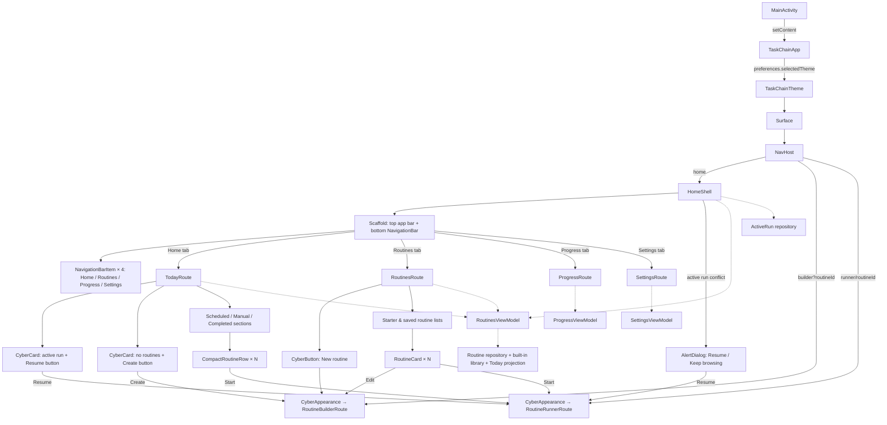
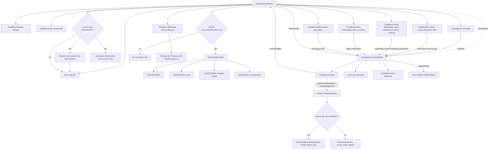
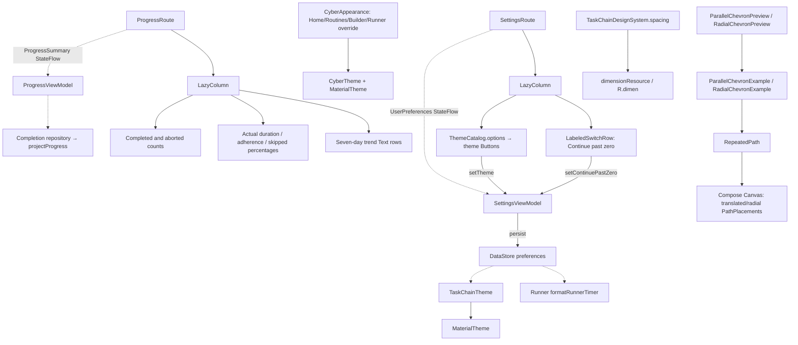

# TaskChain UI Component Wiring — `feature/substeps`

**Source repository:** [matthewdmanning/TaskChain](https://github.com/matthewdmanning/TaskChain/tree/feature/substeps)  
**Inspected commit:** `3b573f998b93088cf627b7daed91f544810427ca`  
**Scope:** App-owned Compose components, their Material 3 / cyberpunkAndroid children, navigation, ViewModel state and intent wiring, Android picker/dialog integrations, and separate UI preview components.  
**Legend:** Solid arrows represent composition, event propagation, or direct calls, as labeled. Dashed arrows represent observation/dependency. An isolated preview subtree is intentionally not a production navigation route.

## 1. Application shell, navigation, Home and Routines

Notes: The home and routines tabs are **conditional content** inside `HomeShell`; they are not separate `NavHost` routes. `CyberAppearance` wraps Home/Routines content and the separate Builder/Runner routes. `RoutineList` is an additional declared reusable composable but **is not invoked by the production flow** in this commit. Home completed rows show success status, not a start control.

## 2. Routine builder and secondary-step editor

```mermaid
flowchart TD
  B[RoutineBuilderRoute] -.->|collectAsStateWithLifecycle| BVM[RoutineBuilderViewModel / BuilderState]
  B --> Header[Scaffold / CenterAlignedTopAppBar]
  B --> Fields[CyberCard: OutlinedTextField title + description]
  Fields -->|setTitle / setDescription| BVM
  B --> SettingsCard[CyberCard: routine settings]
  SettingsCard --> Schedule[ScheduleEditor]
  SettingsCard --> Sound[LabeledSwitchRow: sound]
  SettingsCard --> Vibrate[LabeledSwitchRow: vibration]
  Schedule --> Repeat[LabeledSwitchRow: repeating]
  Schedule --> Freq[Frequency Button / OutlinedButton group]
  Schedule --> Days[WeekdaySelector → 7 FilterChips]
  Schedule --> AtTime[TextButton → Android TimePickerDialog]
  Schedule --> Reminder[LabeledSwitchRow: remind every]
  Schedule --> ReminderDuration[TextButton → Android NumberPicker dialog]
  Repeat -->|setScheduleEnabled| BVM
  Freq -->|setScheduleFrequency| BVM
  Days -->|setScheduleDays| BVM
  AtTime -->|setScheduleTime| BVM
  Reminder -->|setRemindEveryMinutes| BVM
  ReminderDuration -->|setRemindEveryMinutes| BVM
  Sound -->|setSoundEnabled| BVM
  Vibrate -->|setVibrateEnabled| BVM
  B --> MainCards[Main-step Card × N: role = MAIN only]
  MainCards --> MainHead[Title + duration + Drag icon + Edit IconButton]
  MainHead -->|editStep| BVM
  MainHead -->|drag / accessibility reorder| Move[moveStep - moves main + its substeps]
  Move --> BVM
  MainCards -->|only when editingStepIndex matches| EditPanel[Main-step editing panel]
  EditPanel --> Name[OutlinedTextField: main-step title]
  EditPanel --> Duration[OutlinedButton: main duration]
  Duration --> Picker[showDurationPicker: two NumberPickers]
  Name -->|setPendingStepTitle| BVM
  Picker -->|setPendingTimerSeconds| BVM
  EditPanel --> Sub[SubstepEditor]
  Sub --> Existing[Existing SECONDARY rows filtered by parentStepId]
  Existing --> Title[OutlinedTextField: substep title]
  Existing --> Time[OutlinedButton: substep duration]
  Existing --> Remove[TextButton: remove ×]
  Title -->|setSubstepTitle| BVM
  Time -->|onPickDuration via shared picker| Picker
  Picker -->|setSubstepTimerSeconds for substep| BVM
  Remove -->|removeSubstep| BVM
  Sub --> New[New-substep row]
  New --> Plus[IconButton: circled plus]
  New --> NewTitle[OutlinedTextField: Create a new substep]
  New --> NewTime[OutlinedButton: candidate duration]
  NewTime -->|same picker| Picker
  Plus -->|addSubstep parentIndex, title, duration| BVM
  EditPanel -->|removeStep incl. children| BVM
  B --> AddMain[CyberButton: Add step]
  AddMain -->|addStep MAIN| BVM
  B --> Footer[Discard + Save]
  Footer -->|save after validation| BVM
  Footer -->|dirty close| Discard[AlertDialog: Discard changes / Keep editing]
  BVM -->|save| RoutineRepo[Routine repository]
  BVM -->|schedule or cancel reminder| Scheduler[AndroidReminderScheduler]
```

**State and structure:** `RoutineTemplate.steps` is a flat ordered list. `RoutineStep.role` is `MAIN` or `SECONDARY`; a secondary step holds `parentStepId` referencing a main step. Only main steps create top-level cards; each edit panel passes its parent to `SubstepEditor`, which filters the flat list by parent ID. The branch does not use `CyberAccordion` here: editing is toggled by the Edit button and `editingStepIndex`. The main and secondary durations share `showDurationPicker` through a callback.

## 3. Routine runner, countdown and feedback

The secondary timer uses the same current-step remaining-time and dial mechanics as a main step, with a different sound hook. The dial is **not rendered for untimed steps**. The visible step-status indicators are filtered to **MAIN** steps, rather than each individual secondary step. The runner has no gesture-tracking composable or completion-presentation wrapper in this branch.

## 4. Progress, settings and cross-cutting component dependencies

`RepeatedPath` and its examples/previews are in `ui/designsystem`; they are not referenced by a production route. `RoutineList` is also a declared but currently unused UI composable.

## 5. Component inventory and source mapping

All `@Composable` functions found in the branch's app source are accounted for below, including small pure-presentation helpers and design-only previews.

| Kotlin file | Composable functions | Where wired |
|---|---|---|
| [TaskChainApp.kt](https://github.com/matthewdmanning/TaskChain/blob/feature/substeps/app/src/main/java/com/taskchain/ui/TaskChainApp.kt) | `TaskChainApp`, `CyberAppearance`, `HomeShell` | Root/navigation/theme |
| Same | `TodayRoute`, `CompactRoutineRow`, `RoutinesRoute`, `RoutineCard` | Home/Routines tabs |
| Same | `RoutineList` | Reusable declaration; no production call found |
| Same | `RoutineBuilderRoute`, `ScheduleEditor`, `LabeledSwitchRow`, `WeekdaySelector` | Builder; `LabeledSwitchRow` reused by Settings |
| Same | `frequencyLabel`, `dayLabel` | Builder string-resource helpers |
| Same | `RoutineRunnerRoute`, `RunCountdownDial`, `formatRunnerTimer` | Runner and formatted display helper |
| Same | `ProgressRoute`, `SettingsRoute` | Home tab content |
| [SubstepUi.kt](https://github.com/matthewdmanning/TaskChain/blob/feature/substeps/app/src/main/java/com/taskchain/ui/SubstepUi.kt) | `SubstepEditor` | Main-step edit panel only |
| [TaskChainTheme.kt](https://github.com/matthewdmanning/TaskChain/blob/feature/substeps/app/src/main/java/com/taskchain/ui/designsystem/TaskChainTheme.kt) | `TaskChainTheme`, `TaskChainDesignSystem.spacing` | Global theme and spacing provider |
| [RepeatedPath.kt](https://github.com/matthewdmanning/TaskChain/blob/feature/substeps/app/src/main/java/com/taskchain/ui/designsystem/RepeatedPath.kt) | `RepeatedPath` | Design example Canvas primitive |
| [RepeatedPathExamples.kt](https://github.com/matthewdmanning/TaskChain/blob/feature/substeps/app/src/main/java/com/taskchain/ui/designsystem/RepeatedPathExamples.kt) | `ParallelChevronExample`, `RadialChevronExample`, `integerResourceValue`, `ParallelChevronPreview`, `RadialChevronPreview` | Design-time examples and previews |

There are **28 declared `@Composable` functions** across these app source files. Not every declaration is a distinct visible widget; the count includes string/value helpers and previews.

### Key source files beyond composables

- [MainActivity.kt](https://github.com/matthewdmanning/TaskChain/blob/feature/substeps/app/src/main/java/com/taskchain/MainActivity.kt) — `setContent` hosting and terminal-session recovery.
- [FeatureViewModels.kt](https://github.com/matthewdmanning/TaskChain/blob/feature/substeps/app/src/main/java/com/taskchain/ui/FeatureViewModels.kt) — `RoutinesViewModel`, `RoutineBuilderViewModel`, `RoutineRunnerViewModel`, `ProgressViewModel`, `SettingsViewModel` and their observable state/action methods.
- [Models.kt](https://github.com/matthewdmanning/TaskChain/blob/feature/substeps/app/src/main/java/com/taskchain/domain/model/Models.kt) — `RoutineStepRole`, `parentStepId`, `RoutineTemplate`, `RoutineRun`, `UserPreferences`.
- [RoutineRunEngine.kt](https://github.com/matthewdmanning/TaskChain/blob/feature/substeps/app/src/main/java/com/taskchain/domain/run/RoutineRunEngine.kt) — deterministic current-step transitions, timer state and expiry eligibility.
- [ReminderScheduler.kt](https://github.com/matthewdmanning/TaskChain/blob/feature/substeps/app/src/main/java/com/taskchain/reminder/ReminderScheduler.kt) — Android alarm/notification and main-versus-secondary timer feedback.
- [RunnerMotion.kt](https://github.com/matthewdmanning/TaskChain/blob/feature/substeps/app/src/main/java/com/taskchain/ui/designsystem/RunnerMotion.kt) — runner title entrance config.

**Source fidelity:** This diagram is a static code wiring map, not a screenshot or a runtime navigation trace. Material 3 and cyberpunkAndroid library internals are represented as dependencies, not inventoried as app-owned components. No application source files were modified to produce this documentation.