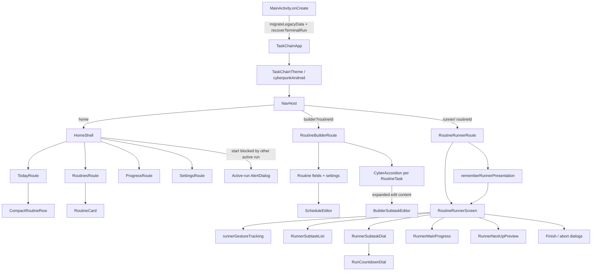
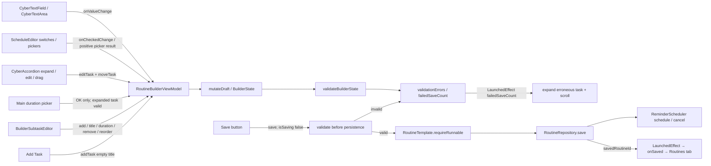
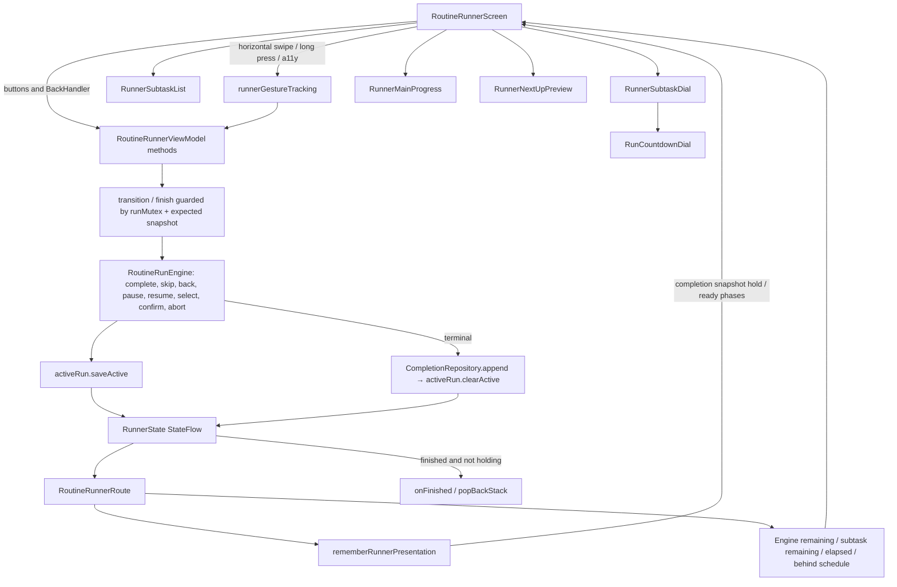
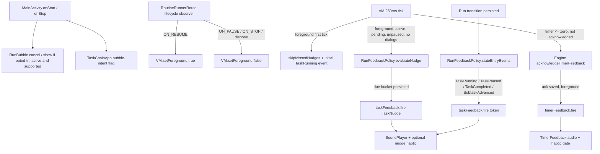

# TaskChain UI Wiring — `origin/refactor-feature-integration`

> **Agent entrypoint:** static, source-grounded navigation, composition, state, and effect graph. Pair with [`TaskChain-UI-Actions-refactor-feature-integration.md`](TaskChain-UI-Actions-refactor-feature-integration.md) and [`TaskChain-UI-Action-Index-refactor-feature-integration.jsonl`](TaskChain-UI-Action-Index-refactor-feature-integration.jsonl) for trigger-level analysis.

- **Repository:** [`matthewdmanning/TaskChain`](https://github.com/matthewdmanning/TaskChain)
- **Verified branch:** `refactor-feature-integration` (the remote branch commonly checked out locally as `origin/refactor-feature-integration`)
- **Pinned source SHA:** [`9ac12352b6dd20faffd8e2851b48c54d28d9024e`](https://github.com/matthewdmanning/TaskChain/tree/9ac12352b6dd20faffd8e2851b48c54d28d9024e)
- **Scope:** app-owned Compose UI and relevant Android lifecycle, state, domain-engine, persistence, sound/haptics, and background bubble integration. CyberpunkAndroid and Material internals are *external dependencies*; not enumerated.
- **Method:** static inspection of the pinned branch; diagrams describe call/data/control wiring, not observed runtime traces. `FeatureViewModels.kt` and `TaskChainApp.kt` are large entrypoints. Line anchors are commit-pinned, not branch-relative.

## 1. Composition, routes, and navigation

**Routing observations.** The Home tab state is `rememberSaveable`, with `HomeTab` values HOME / ROUTINES / PROGRESS / SETTINGS. Starting a different routine while another run is active shows `blockedRoutine` dialog instead of immediate navigation. A bubble-origin `openActiveRun` flag can navigate directly to the active runner. Successful builder save navigates to Routines tab; runner completion pops the back stack **only after** presentation completion hold ends.

**Source:** [MainActivity.kt:23–52](https://github.com/matthewdmanning/TaskChain/blob/9ac12352b6dd20faffd8e2851b48c54d28d9024e/app/src/main/java/com/taskchain/MainActivity.kt#L23-L52), [TaskChainApp.kt:181–330](https://github.com/matthewdmanning/TaskChain/blob/9ac12352b6dd20faffd8e2851b48c54d28d9024e/app/src/main/java/com/taskchain/ui/TaskChainApp.kt#L181-L330), [TaskChainApp.kt:1298–1372](https://github.com/matthewdmanning/TaskChain/blob/9ac12352b6dd20faffd8e2851b48c54d28d9024e/app/src/main/java/com/taskchain/ui/TaskChainApp.kt#L1298-L1372).

## 2. Builder: UI → draft mutation → validation → storage

**Critical model change:** the parent is `RoutineTask`, containing `subtasks: List<RoutineSubtask>`. The task duration is derived from the sum of subtask durations when subtasks exist; otherwise it comes from `timerSeconds`. **Adding the first subtask** inherits the parent timer and clears `timerSeconds`. The main duration button is disabled when the task owns subtasks. Draft subtask durations retain *raw strings* in `pendingSubtaskDurations` to report invalid entries, even if the last valid model value remains unchanged. Editing a different task or adding a task can be blocked by the current task's invalid pending duration. Validation/save errors drive an effect to expand and scroll to the first error.

**Source:** [Models.kt:27–85](https://github.com/matthewdmanning/TaskChain/blob/9ac12352b6dd20faffd8e2851b48c54d28d9024e/app/src/main/java/com/taskchain/domain/model/Models.kt#L27-L85), [TaskChainApp.kt:686–1122](https://github.com/matthewdmanning/TaskChain/blob/9ac12352b6dd20faffd8e2851b48c54d28d9024e/app/src/main/java/com/taskchain/ui/TaskChainApp.kt#L686-L1122), [BuilderSubtaskEditor.kt:48–148](https://github.com/matthewdmanning/TaskChain/blob/9ac12352b6dd20faffd8e2851b48c54d28d9024e/app/src/main/java/com/taskchain/ui/BuilderSubtaskEditor.kt#L48-L148), [FeatureViewModels.kt:151–238](https://github.com/matthewdmanning/TaskChain/blob/9ac12352b6dd20faffd8e2851b48c54d28d9024e/app/src/main/java/com/taskchain/ui/FeatureViewModels.kt#L151-L238), [FeatureViewModels.kt:306–698](https://github.com/matthewdmanning/TaskChain/blob/9ac12352b6dd20faffd8e2851b48c54d28d9024e/app/src/main/java/com/taskchain/ui/FeatureViewModels.kt#L306-L698).

## 3. Runner: intent → domain → persisted state → presentation

**Subtask semantics:** tapping **Complete** can advance the *active subtask* rather than complete its main task. Engine `finishCurrent` appends a `SubtaskAdvancement` and advances `activeSubtaskId`; only the final subtask completes the main task. Main-task time continues uninterrupted. A timer expiry does **not** automatically complete a task/subtask; the tick acknowledges and delivers feedback. Right swipe is **advance to next already-finished main task**, not unconditional next-task progression.

**Presentation semantics:** the VM may delay the next task's start timestamp for the completion/ready animation, while `rememberRunnerPresentation` temporarily shows the completed snapshot. `presentation.holdingCompletion` suppresses user actions, and the finished route does not pop until hold ends. Animation behavior also depends on foreground lifecycle, persisted setting, and Android animator setting.

**Source:** [TaskChainApp.kt:1298–1749](https://github.com/matthewdmanning/TaskChain/blob/9ac12352b6dd20faffd8e2851b48c54d28d9024e/app/src/main/java/com/taskchain/ui/TaskChainApp.kt#L1298-L1749), [FeatureViewModels.kt:709–1009](https://github.com/matthewdmanning/TaskChain/blob/9ac12352b6dd20faffd8e2851b48c54d28d9024e/app/src/main/java/com/taskchain/ui/FeatureViewModels.kt#L709-L1009), [RoutineRunEngine.kt:350–425](https://github.com/matthewdmanning/TaskChain/blob/9ac12352b6dd20faffd8e2851b48c54d28d9024e/app/src/main/java/com/taskchain/domain/run/RoutineRunEngine.kt#L350-L425), [RunPresentation.kt:33–90](https://github.com/matthewdmanning/TaskChain/blob/9ac12352b6dd20faffd8e2851b48c54d28d9024e/app/src/main/java/com/taskchain/ui/RunPresentation.kt#L33-L90).

## 4. Feedback and lifecycle wiring

**Do not confuse three feedback paths:** (1) UI-button `pressAction` haptics use the Settings vibration-intensity composition local; (2) semantic state events and periodic nudges go through `RunFeedbackPolicy` → `TaskFeedback`; (3) zero-countdown feedback goes through `TimerFeedback` after acknowledgement is saved. The old `RoutineStepRole.SECONDARY` / `TimerFeedback.fireSecondary` wiring is **not** the target-branch architecture.

**Source:** [MainActivity.kt:35–57](https://github.com/matthewdmanning/TaskChain/blob/9ac12352b6dd20faffd8e2851b48c54d28d9024e/app/src/main/java/com/taskchain/MainActivity.kt#L35-L57), [FeatureViewModels.kt:823–981](https://github.com/matthewdmanning/TaskChain/blob/9ac12352b6dd20faffd8e2851b48c54d28d9024e/app/src/main/java/com/taskchain/ui/FeatureViewModels.kt#L823-L981), [RunFeedbackPolicy.kt:30–143](https://github.com/matthewdmanning/TaskChain/blob/9ac12352b6dd20faffd8e2851b48c54d28d9024e/app/src/main/java/com/taskchain/domain/run/RunFeedbackPolicy.kt#L30-L143), [TaskFeedback.kt:75–93](https://github.com/matthewdmanning/TaskChain/blob/9ac12352b6dd20faffd8e2851b48c54d28d9024e/app/src/main/java/com/taskchain/reminder/TaskFeedback.kt#L75-L93), [PressFeedback.kt:13–66](https://github.com/matthewdmanning/TaskChain/blob/9ac12352b6dd20faffd8e2851b48c54d28d9024e/app/src/main/java/com/taskchain/ui/PressFeedback.kt#L13-L66).

## 5. Component and source lookup

| Functional area | Entry/component | Source line | Primary state/action owner |
|---|---|---|---|
| Activity & bubble launch | `MainActivity` | `MainActivity.kt:17–57` | `AppContainer`, `RunBubble` |
| Theme & navigation | `TaskChainApp` | `ui/TaskChainApp.kt:181–245` | `NavController`, `UserPreferences` |
| Home tabs & conflict dialog | `HomeShell` | `ui/TaskChainApp.kt:249–331` | local selected tab; active run |
| Today | `TodayRoute`, `CompactRoutineRow` | `ui/TaskChainApp.kt:335–482` | `RoutinesViewModel` |
| Routines | `RoutinesRoute`, `RoutineCard` | `ui/TaskChainApp.kt:486–622` | `RoutinesViewModel` |
| Legacy reusable list (no live call in routed UI) | `RoutineList` | `ui/TaskChainApp.kt:657–682` | caller-supplied callbacks |
| Builder | `RoutineBuilderRoute` | `ui/TaskChainApp.kt:686–1122` | `RoutineBuilderViewModel`, `BuilderState` |
| Schedule | `ScheduleEditor`, `LabeledSwitchRow`, `WeekdaySelector` | `ui/TaskChainApp.kt:1126–1230` | `RoutineBuilderViewModel` |
| Subtask edit | `BuilderSubtaskEditor`, `BuilderErrorText`, `fieldError` | `ui/BuilderSubtaskEditor.kt:48–164` | callbacks to builder VM |
| Runner VM adapter | `RoutineRunnerRoute` | `ui/TaskChainApp.kt:1298–1372` | `RoutineRunnerViewModel`, `RoutineRunEngine` |
| Runner display | `RoutineRunnerScreen` | `ui/TaskChainApp.kt:1379–1749` | props + callbacks, no direct repository writes |
| Runner gesture recognizer | `runnerGestureTracking` | `ui/RunnerGestures.kt:36–147` | callbacks to runner VM |
| Delayed visual state | `rememberRunnerPresentation` | `ui/RunPresentation.kt:33–91` | Compose remembered snapshots and effects |
| Ready-phase labels | `taskReadyPhase`, `shouldHoldTaskReadyTransition` | `ui/TaskReadyTransition.kt:21–38` | pure helpers |
| Active subtask text | `RunnerSubtaskList` | `ui/RunnerSubtaskContent.kt:24–54` | `RoutineRunTask` snapshot |
| Concentric subtask rings | `RunnerSubtaskDial` | `ui/RunnerSubtaskDial.kt:29–72` | elapsed millis from engine |
| Main dial | `RunCountdownDial` | `ui/TaskChainApp.kt:1753–1913` | timer props, theme and animation gates |
| Main progress | `RunnerMainProgress` | `ui/RunnerMainProgress.kt:31–68` | run statuses and animation gates |
| Next-up preview | `RunnerNextUpPreview` | `ui/RunnerNextUpPreview.kt:22–36` | upcoming pending tasks |
| History | `ProgressRoute` | `ui/TaskChainApp.kt:1938–1956` | `ProgressViewModel` |
| Preferences | `SettingsRoute` | `ui/TaskChainApp.kt:1960–2022` | `SettingsViewModel` |
| Press feedback wrappers | `CyberButton`, `Button`, `OutlinedButton`, `TextButton` | `ui/PressFeedback.kt:17–66` | `pressAction` + supplied callback |
| Domain transitions | `RoutineRunEngine` | `domain/run/RoutineRunEngine.kt:16–425` | immutable `RoutineRun` transitions |
| Semantic feedback decisions | `RunFeedbackPolicy` | `domain/run/RunFeedbackPolicy.kt:24–144` | event production and nudge buckets |
| Actual sound/haptic adapter | `AndroidTaskFeedback` | `reminder/TaskFeedback.kt:43–98` | sound/haptic gates |
| Bubble adapter | `RunBubble` | `reminder/RunBubble.kt:26–112` | Android notification/bubble gates |

All relative Kotlin paths in the table have prefix `app/src/main/java/com/taskchain/`. Use the **pinned SHA** above to open source line anchors; subsequent commits may shift line numbers.

### Render-only helpers and non-routed examples

- `frequencyLabel` (`ui/TaskChainApp.kt:1251–1258`), `dayLabel` (`1262–1272`), `statusColor` (`2032–2036`), `countdownProgress` (`1915–1919`), `formatRunnerTimer` (`1923–1934`) and `routineDurationParts` (`650–653`) format UI or return presentation values; they do not dispatch a run transition.
- `TaskChainTheme` (`ui/designsystem/TaskChainTheme.kt:95–166`), `TaskChainDesignSystem.spacing` (`80–84`), and `TaskChainDesignSystem.subtaskColor` (`72–76`) supply theme and visual tokens.
- `RepeatedPath` (`ui/designsystem/RepeatedPath.kt:80+`) and `ParallelChevronExample` / `RadialChevronExample` (`ui/designsystem/RepeatedPathExamples.kt:25+, 44+`) are design-system drawing/examples; no live route calls were identified in the inspected app-owned call graph.
- `RoutineList` (`ui/TaskChainApp.kt:657–682`) is declared and callable but not invoked by the actual Home/Routines navigation tree in this branch.

## 6. Prior-branch assumptions invalid on this branch

| `feature/substeps` baseline | `refactor-feature-integration` source of truth |
|---|---|
| `SubstepUi.kt` / `SubstepEditor` | Removed; `BuilderSubtaskEditor.kt` with ID-scoped callbacks and drag reordering |
| Flat `RoutineStep` with `RoutineStepRole.MAIN/SECONDARY` | `RoutineTask.subtasks` with `RoutineSubtask`, plus runtime `activeSubtaskId`/advancement markers |
| Main/substep duration picker shared | Main task has native NumberPickers; subtask duration is editable `CyberTextField` raw seconds |
| Secondary timer type switching in tick | Main timer zero feedback plus semantic `SubtaskAdvanced` token via separate policy/adapter |
| Runner single composable/mixed state | `RoutineRunnerRoute` adapter + `RoutineRunnerScreen` + separate presenter, gesture recognizer and composables |
| Runner actions only buttons | Buttons plus swipe and long-press gesture/accessibility actions |
| Settings theme + overtime | Also subtask remaining visibility, vibration intensity, transitions, bubble-on-minimize |

## 7. AI debugging starting points

- **“Subtask title/duration not saving”**: inspect `BuilderSubtaskEditor` callbacks → `RoutineBuilderViewModel.setSubtask*` → `pendingSubtaskDurations` → `validateBuilderState` → `save` → `RoutineTask.subtasks`.
- **“Cannot expand another task”**: inspect `changeExpansion`, `editTask` guard against invalid `pendingTimerSeconds` and `failedSaveCount` recovery effect.
- **“Complete advances wrong thing”**: inspect `RoutineRunnerScreen.onComplete` → VM `complete` → `RoutineRunEngine.finishCurrent` branch for `source.subtasks`.
- **“Timer zero sound repeated/missing”**: inspect foreground/confirmation guard in VM `tick`, `needsTimerFeedback`, persistence of acknowledgment, then `TimerFeedback.fire` gates.
- **“Wrong sound when a subtask advances”**: inspect `RunFeedbackPolicy.subtaskAdvancedEvents`, `fireStateFeedback`, token `soundSettings` and `AndroidTaskFeedback`.
- **“Completion animation delays timer or navigation”**: inspect VM `prepareNextTask`, presenter `LaunchedEffect` hold and ready phases, route `state.finished`/`holdingCompletion` gate.
- **“Gestures trigger the wrong action”**: distinguish left/right swipe from long-press, child pointer handling, and **right swipe only selects a later finished task**.
- **“Bubble missing”**: inspect `onStop`, `bubbleOnMinimize`, active-run condition, `RunBubble.isAvailable` permission/OS/channel checks.

**Verification limits:** Static inspection only; no app build, emulator execution, or interaction tests were performed. This reference does not imply runtime verification.